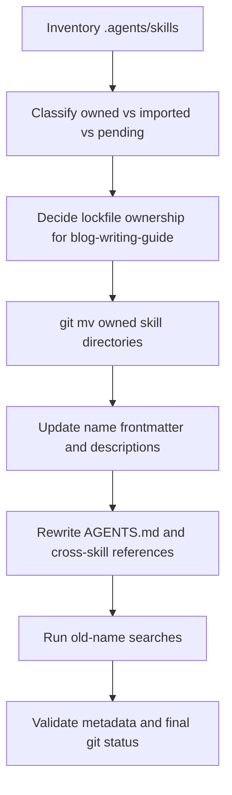

# Plan: Agent Skill Naming Improvements

Date: 2026-05-10

Implementation update:

- The first-pass repo-owned skill renames were applied.
- `blog-writing-guide` was kept under its existing name because it is still represented in `skills-lock.json`; the five-minute default reading-time rule was added there instead.
- `technical-diagram-image-review` was finalized under `technical-blog-image-review`.

## Goal

Make the repository's agent skills easier to scan, understand, and invoke by standardizing skill names around clear user-facing jobs, reducing abbreviations, and separating Ylang-owned workflow skills from imported third-party guidance skills.

This plan is based on the current repo state:

- Repo instructions in `AGENTS.md`.
- Skill directories under `.agents/skills/`.
- Skill metadata in each `SKILL.md` frontmatter.
- Installed skill lock metadata in `skills-lock.json`.
- The local agent skills article at `data/blogs/agent-skills.mdx`.
- The local `skill-creator` guidance for skill structure and triggering descriptions.

## Current Findings

The repo currently has 17 skill directories:

| Current name                       | Ownership                                  | Current role                                                | Naming issue                                                                             |
| ---------------------------------- | ------------------------------------------ | ----------------------------------------------------------- | ---------------------------------------------------------------------------------------- |
| `blog-authoring`                   | Ylang-owned                                | Creates MDX/frontmatter/assets for blog posts               | Sounds like prose writing, but it mostly handles repo setup and MDX structure            |
| `blog-writing-guide`               | Lockfile-managed, Ylang-customized content | Primary Ylang editorial voice and prose rubric              | Understandable, but "guide" is weaker than "editorial" for the actual behavior           |
| `blog-review`                      | Ylang-owned                                | Factuality-first review of blog drafts                      | Too broad for the review standard it enforces                                            |
| `blog-image-creator`               | Ylang-owned                                | Crops/prepares `cardImage.png` and `blogHeader.png`         | "Creator" implies generation, but the skill mainly crops and prepares images             |
| `blog-social-post-generator`       | Ylang-owned                                | Creates launch/social copy for blog or project posts        | Verbose and platform-specific wording can be shorter                                     |
| `technical-diagram-image-gen`      | Ylang-owned                                | Generates technical blog image prompts/assets               | Uses abbreviation `gen` and undersells non-diagram technical artwork                     |
| `technical-diagram-image-review`   | Untracked Ylang-owned                      | Independent review of generated technical blog images       | Uses abbreviation-adjacent phrasing and is currently untracked                           |
| `beautiful-oil-painting-image-gen` | Ylang-owned                                | Generates oil-painting style image prompts/assets           | "beautiful" is subjective, and `gen` is less readable than `generator`                   |
| `end-to-end-blog-creation`         | Ylang-owned                                | Coordinates full blog workflow                              | "End-to-end" is clunky and less concrete than the actual publishing workflow             |
| `trending-blog-topic-research`     | Ylang-owned                                | Researches current technical discourse for topic candidates | Long, but mostly clear; "trending" can overemphasize virality over durable topic quality |
| `github-content-calendar`          | Ylang-owned                                | Manages GitHub Issues/Projects content calendar             | Names implementation first instead of the user job                                       |
| `anthropic-blog-style`             | Ylang-owned                                | Applies Anthropic-like blog style                           | Understandable, but "style" alone does not make writing/revision behavior obvious        |
| `frontend-design`                  | Imported                                   | General frontend UI generation/design                       | Keep name unless intentionally forking the imported skill                                |
| `next-best-practices`              | Imported                                   | Next.js guidance                                            | Keep name unless intentionally forking the imported skill                                |
| `vercel-react-best-practices`      | Imported                                   | React/Next performance guidance                             | Keep name unless intentionally forking the imported skill                                |
| `vercel-composition-patterns`      | Imported                                   | React composition guidance                                  | Keep name unless intentionally forking the imported skill                                |
| `web-design-guidelines`            | Imported                                   | UI/accessibility/design review                              | Keep name unless intentionally forking the imported skill                                |

There is also a structural issue worth addressing during the rename pass: `.agents/skills/github-content-calendar/SKILL.md` appears to contain a repeated frontmatter/name/description block later in the file. That should be removed or explained before renaming so the skill has one authoritative metadata block.

## Naming Standard

Use this convention for repo-owned skill names:

```text
<domain>-<job>[-<artifact-or-mode>]
```

Rules:

1. Use lowercase kebab-case only, and keep the `name` frontmatter equal to the parent directory.
2. Prefer reader-facing jobs over implementation details.
   - Prefer `content-calendar-management` over `github-content-calendar` unless GitHub itself is the user-facing reason to choose the skill.
3. Avoid subjective adjectives.
   - Prefer `oil-painting-image-generator` over `beautiful-oil-painting-image-gen`.
4. Avoid abbreviations in public skill names.
   - Prefer `generator` over `gen`.
   - Keep established technical terms like `mdx` only when they disambiguate the skill.
5. Keep names specific enough to avoid collisions in the global skill list.
   - `blog-social-copy` is clearer than `social-copy` in a repo that may also have project, newsletter, or investor-writing workflows.
6. Name coordinator skills after the workflow outcome, not the fact that they are comprehensive.
   - Prefer `blog-publishing-workflow` over `end-to-end-blog-creation`.
7. Keep imported lockfile-managed skill names stable unless the team explicitly decides to fork them. Renaming imported skills requires a lockfile/source ownership decision.

## Proposed Rename Map

### Recommended First-Pass Renames

| Old name                           | New name                         | Why                                                                         |
| ---------------------------------- | -------------------------------- | --------------------------------------------------------------------------- |
| `blog-authoring`                   | `blog-mdx-authoring`             | Clarifies that the skill owns MDX/frontmatter/assets, not prose style       |
| `blog-writing-guide`               | `blog-editorial-guide`           | Better reflects voice, structure, title, and quality rubric behavior        |
| `blog-review`                      | `blog-factuality-review`         | Makes the review standard visible from the name                             |
| `blog-image-creator`               | `blog-image-cropper`             | Matches the actual crop/prepare responsibility                              |
| `blog-social-post-generator`       | `blog-social-copy`               | Shorter and more readable while keeping the blog domain                     |
| `technical-diagram-image-gen`      | `technical-blog-image-generator` | Removes abbreviation and covers more than diagrams                          |
| `technical-diagram-image-review`   | `technical-blog-image-review`    | Pairs with the generator and describes the review surface                   |
| `beautiful-oil-painting-image-gen` | `oil-painting-image-generator`   | Removes subjective adjective and abbreviation                               |
| `end-to-end-blog-creation`         | `blog-publishing-workflow`       | Names the final workflow outcome                                            |
| `trending-blog-topic-research`     | `blog-topic-research`            | Shorter while the description can preserve trend/current-discourse triggers |
| `github-content-calendar`          | `content-calendar-management`    | Names the workflow, not the storage implementation                          |
| `anthropic-blog-style`             | `anthropic-style-writing`        | Makes the writing/revision behavior explicit                                |

### Names To Keep For Now

Keep these as-is unless the work explicitly becomes a fork of the upstream skills:

- `frontend-design`
- `next-best-practices`
- `vercel-react-best-practices`
- `vercel-composition-patterns`
- `web-design-guidelines`

If the team wants all names to be Ylang-prefixed later, do that as a separate fork/migration because these names are represented in `skills-lock.json`.

## Compatibility Strategy

Skill metadata does not provide a universal alias mechanism. To preserve discoverability after renaming:

1. Update every renamed skill description to include one short legacy phrase for one migration cycle:

   ```yaml
   description: Use this skill ... Also use when the user mentions the former skill name `<old-name>`.
   ```

2. Update `AGENTS.md` with the new preferred names and a short "Legacy names" table.
3. Update all cross-skill references inside `.agents/skills/**/SKILL.md` from old names and paths to new names and paths.
4. Do not keep duplicate alias skill directories by default. They make the skill list harder to read and can cause the old name to keep triggering. Only add alias stub skills if external tooling proves it calls exact old skill names.

## Implementation Plan

### Phase 1: Inventory And Ownership Lock

Create an explicit inventory before any rename:

```bash
git status --short
find .agents/skills -maxdepth 2 -name SKILL.md -print
rg -n "^(name|description):" .agents/skills/*/SKILL.md
cat skills-lock.json
```

Classify each skill as:

- `owned`: created for this repo and safe to rename.
- `imported`: represented in `skills-lock.json`; keep stable unless forking.
- `pending`: untracked or in-progress, such as `technical-diagram-image-review`.

Decision needed before implementation: whether `blog-writing-guide` is still intended to be lockfile-managed from `getsentry/skills` or should become fully Ylang-owned. Its current body is Ylang-specific, but `skills-lock.json` still tracks it as an installed skill. If it is renamed to `blog-editorial-guide`, update or remove the lockfile entry in the same change and document that it is now local-owned.

### Phase 2: Rename Directories And Frontmatter

Use `git mv` for tracked directories so history is preserved:

```bash
git mv .agents/skills/blog-authoring .agents/skills/blog-mdx-authoring
git mv .agents/skills/blog-review .agents/skills/blog-factuality-review
git mv .agents/skills/blog-image-creator .agents/skills/blog-image-cropper
git mv .agents/skills/blog-social-post-generator .agents/skills/blog-social-copy
git mv .agents/skills/technical-diagram-image-gen .agents/skills/technical-blog-image-generator
git mv .agents/skills/beautiful-oil-painting-image-gen .agents/skills/oil-painting-image-generator
git mv .agents/skills/end-to-end-blog-creation .agents/skills/blog-publishing-workflow
git mv .agents/skills/trending-blog-topic-research .agents/skills/blog-topic-research
git mv .agents/skills/github-content-calendar .agents/skills/content-calendar-management
git mv .agents/skills/anthropic-blog-style .agents/skills/anthropic-style-writing
```

For currently untracked directories, either:

- Add them under the new final name directly, or
- Move them normally and stage the new directory explicitly later.

For each renamed `SKILL.md`:

- Update `name:` to the new directory name.
- Update the H1 to a readable title, such as `# Blog MDX Authoring`.
- Rewrite the first sentence of `description:` to state the job in plain language.
- Keep old-name trigger text only as a temporary compatibility phrase.

Example:

```yaml
---
name: blog-mdx-authoring
description: Create and structure Ylang Labs blog MDX posts, including slug selection, frontmatter, asset folders, references, and MDX component conventions. Use when the user wants to create a new blog post file, start a Ylang Labs article, set up blog assets, or convert a content brief into repo-ready MDX. Also use when the user mentions the former skill name `blog-authoring`.
---
```

### Phase 3: Update Cross-References

Update references in these files:

- `AGENTS.md`
- `.agents/skills/**/SKILL.md`
- `skills-lock.json`, only for skills intentionally converted to local-owned or renamed despite lockfile management
- `data/blogs/agent-skills.mdx`, only if it references specific local skill names rather than generic examples

Use exact searches to prevent missed links:

```bash
rg -n "blog-authoring|blog-writing-guide|blog-review|blog-image-creator|blog-social-post-generator|technical-diagram-image-gen|technical-diagram-image-review|beautiful-oil-painting-image-gen|end-to-end-blog-creation|trending-blog-topic-research|github-content-calendar|anthropic-blog-style" .agents AGENTS.md skills-lock.json data/blogs/agent-skills.mdx
```

Update coordinator handoff lists so the new names remain coherent:

```text
blog-topic-research -> content-calendar-management -> blog-editorial-guide -> blog-mdx-authoring -> oil-painting-image-generator -> blog-image-cropper -> blog-social-copy
```

Keep imported skills referenced by their existing names:

```text
frontend-design
next-best-practices
vercel-react-best-practices
vercel-composition-patterns
web-design-guidelines
```

### Phase 4: Clean Skill Metadata Quality

For each repo-owned skill, enforce these metadata checks:

- `name` equals the directory name.
- `description` answers both:
  - What does this skill do?
  - When should it be used?
- Descriptions include likely user phrases, not just internal implementation nouns.
- Descriptions stay concise enough to remain readable in the global skills list.
- No descriptions rely on internal abbreviations like `gen`.
- Cross-skill references use the new names and paths.

Also remove the duplicate metadata-like block inside `content-calendar-management/SKILL.md` if it is confirmed to be accidental duplicate content from the old `github-content-calendar` file.

### Phase 5: Add A Small Naming Guide To `AGENTS.md`

Add a short section under `Required First Steps` or near the skill list:

```markdown
## Repo-Local Skill Naming

- Repo-owned skills live under `.agents/skills/<name>/SKILL.md`.
- Use clear kebab-case names in the form `<domain>-<job>[-<artifact-or-mode>]`.
- Avoid abbreviations such as `gen` in skill names.
- Do not rename lockfile-managed imported skills unless intentionally forking them.
- When renaming a skill, update the directory, `name:` frontmatter, cross-skill references, and this skill list in the same change.
```

Keep this as operational guidance, not a large policy document.

## Migration Diagram



## Validation Plan

Run these checks after implementation:

```bash
git status --short
find .agents/skills -maxdepth 2 -name SKILL.md -print
rg -n "^(name|description):" .agents/skills/*/SKILL.md
rg -n "blog-authoring|blog-writing-guide|blog-review|blog-image-creator|blog-social-post-generator|technical-diagram-image-gen|technical-diagram-image-review|beautiful-oil-painting-image-gen|end-to-end-blog-creation|trending-blog-topic-research|github-content-calendar|anthropic-blog-style" .agents AGENTS.md skills-lock.json data/blogs/agent-skills.mdx
git diff --check
```

Expected result:

- Old names appear only in explicit legacy compatibility text or the migration table.
- New skill directory names match `name:` frontmatter.
- Imported lockfile-managed skills are unchanged unless intentionally forked.
- Unrelated existing dirty files remain untouched.

If a skill validation script is available in the environment, run it after the rename. If it depends on missing Python packages, use an isolated temporary dependency target rather than modifying repo dependencies.

## Rollout Recommendation

Do this in one scoped PR if the team wants one clean migration, because the cross-skill references are tightly coupled. Keep the PR limited to:

- `.agents/skills/**/SKILL.md` directory renames and metadata/reference updates.
- `AGENTS.md` skill list and naming guide.
- `skills-lock.json` only if lockfile-managed skill ownership is intentionally changed.
- `data/blogs/agent-skills.mdx` only if it contains stale repo-specific skill names after the rename.

Do not include generated blog tag files, active draft posts, `refs/`, `temp/`, or unrelated content changes.

## Implementation Decisions

1. `blog-writing-guide` remains stable for now because it is lockfile-managed. Rename it only if the team intentionally forks it out of `skills-lock.json`.
2. Old skill names were not kept as active alias skills. The old names remain documented only in this plan for migration traceability.
3. The untracked `technical-diagram-image-review` skill was finalized under `technical-blog-image-review` as part of the rename pass.
