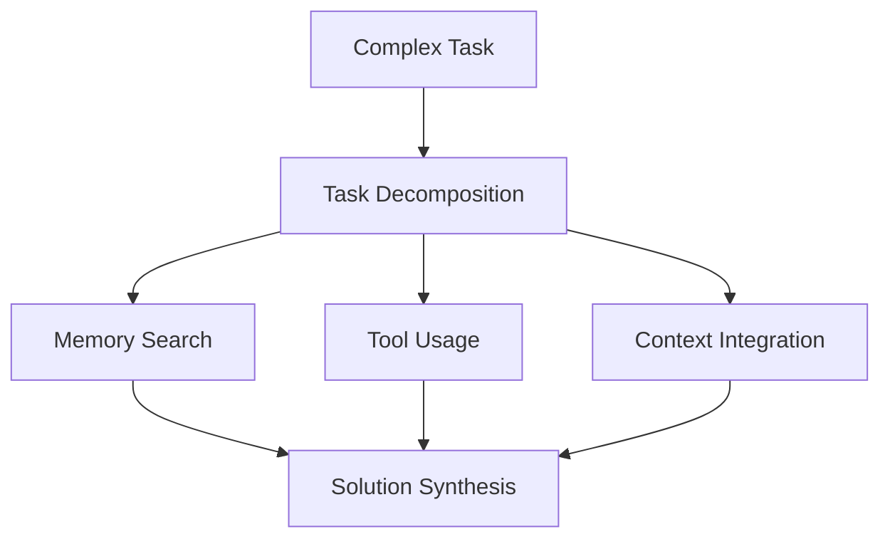
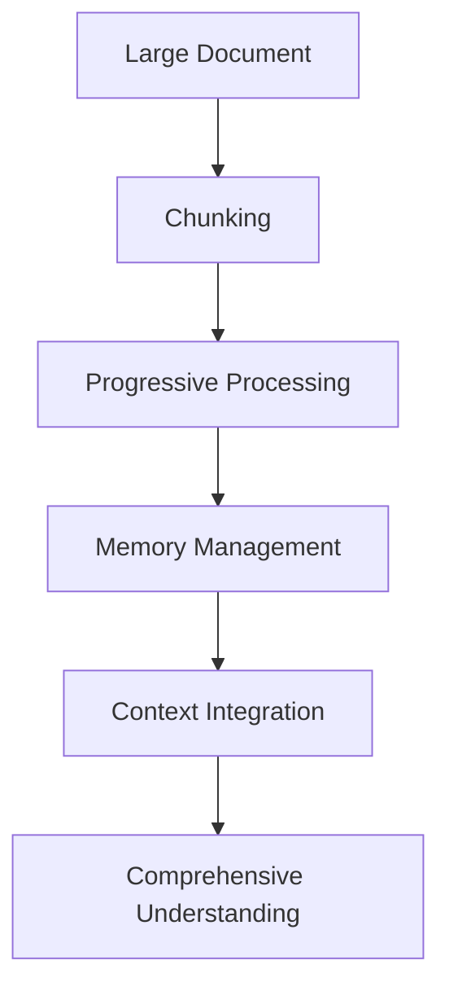

## I. Introduction

The landscape of artificial intelligence is rapidly evolving from simple chatbots to sophisticated autonomous agents. While chatbots excel at generating responses to individual messages, they lack the crucial ability to maintain context and learn from past interactions over the long run. This limitation stems from a fundamental constraint known as the **context window**—a finite space (often measured in tokens) that Large Language Models (LLMs) use to process information at any given time.

To illustrate the challenge, imagine telling a typical chatbot about your birthday. If you start a new conversation hours later, that information is lost—the model begins with a clean slate, forgetting previous details. This isn't just inconvenient; it impedes the creation of AI systems that can adapt, learn from ongoing interactions, and maintain meaningful long-term relationships with users.

### The Context Window Challenge

Think of the context window (like RAM in a computer) as the short-term memory available to an LLM. It’s where immediate conversation details live. Traditional approaches to expand an LLM’s memory have included:

- Increasing context window sizes (at significant computational cost)
- Adding more attention layers
- Storing conversation history in the prompt

Yet, these solutions often lead to:

- The “lost in the middle” problem (models struggle with information located in the middle of large contexts)
- Slower performance as the context grows
- Higher computational costs
- Little autonomy in deciding what to keep or discard

### Enter MemGPT

**MemGPT (Memory GPT)** tackles this limitation with a groundbreaking idea: treating LLMs like operating systems. Similar to how an OS manages computer memory (shuttling data among RAM, disk storage, and cache), MemGPT autonomously manages its own memory tiers. This empowers the model to:

- Maintain persistent memory across conversations
- Engage in multi-step reasoning
- Learn and adapt from past interactions
- Decide what information to keep in “active memory”

As a result, LLMs evolve from passive text generators into agents that can build relationships over time, remember key facts, and optimize resource constraints. Whether you're building personal assistants, enterprise solutions, or research agents, MemGPT’s hierarchical approach to memory management is a key step toward creating more capable and engaging AI systems.

Below, we explore the core architecture, features, and benefits of MemGPT, illustrating how it breaks free from the traditional limits of LLM memory.

---

## II. Breaking Down Agent Memory Architecture

Memory management is at the heart of MemGPT’s power. By organizing information into different tiers—much like a computer’s operating system — MemGPT makes intelligent decisions about what data to keep “in mind” and what to archive for later.

### A. Core Memory Components

#### 1. System Instructions

Think of system instructions as the “kernel” of the agent. These are core directives that define how the agent behaves, which tools it can use, and how it maintains stability. They ensure:

- Consistent personality and operational parameters
- Proper handling of tools and functions
- Stability across all interactions

#### 2. Chat History Management

The agent uses a **FIFO (First-In-First-Out) queue**—a standard queue approach where the oldest items get processed or archived first—to manage conversation data:

<ChatHistoryFlow />

Key points include:

- **Dynamic token management** to prevent overflow
- **Recursive summarization** of older messages
- **Smart prioritization** of important information

#### 3. Memory Sections

MemGPT maintains distinct memory sections, each serving a specific function:

<MemorySectionsFlow />

### B. Memory Types

#### 1. Core Memory

The **Core Memory** is like the LLM’s most accessible workspace. It holds:

- Critical user information (facts, preferences, relationships)
- The agent’s current persona or role
- Immediate context for ongoing tasks
- High-priority data that must remain accessible

For example, when a user says, “My name is Arthur,” the agent stores this immediately in core memory so it can address the user properly in future turns.

#### 2. Recall Memory

The **Recall Memory** is a secondary layer for data that was recently active but not critical enough to remain in the Core Memory. It:

- Maintains a rolling record of recent conversation history
- Summarizes older messages to save space
- Tracks short-term references
- Compresses content progressively as it ages

#### 3. Archival Memory

**Archival Memory** is the deepest storage layer. It holds:

- Unlimited long-term data
- Large documents or datasets
- A vector database (for efficient semantic search and retrieval)
- Summaries of past interactions over the long haul

In practice, data flows between these tiers based on priority and how recently it was accessed:

<MemoryFlowDiagram />

Just as an operating system prioritizes which applications get immediate RAM, MemGPT decides which information remains “top of mind” (Core Memory) and which information moves to deeper storage (Recall or Archival Memory).

---

## III. Key Features of MemGPT

### A. Self-Editing Memory

A key benefit of MemGPT is its ability to edit and update its memory in real time. This means:

- Correcting inaccuracies (e.g., if the user changes their preference from coffee to tea)
- Incorporating new details immediately
- Maintaining a personalized, up-to-date knowledge base

<SelfEditingMemoryFlow />

In everyday use—like a personal assistant that suggests beverages—MemGPT seamlessly updates its memory so it can accurately recall "tea" instead of "coffee" in all subsequent exchanges.

### B. Inner Thoughts

Behind the scenes, MemGPT operates an **internal monologue** that drives more nuanced reasoning. This hidden chain of thought lets the agent:

- Process user input privately
- Decide what to store or discard
- Formulate multi-step plans
- Reflect on its own knowledge gaps and correct them

<InnerThoughtsFlow />

For instance, upon seeing a user's birthday, the inner monologue might note: "This is important for personalization. Store it in Core Memory and keep a record for future greetings."

### C. The Agentic Loop

#### Heartbeat Mechanism

MemGPT's **heartbeat mechanism** lets it operate continuously, without waiting for explicit user prompts. It:

<HeartbeatFlow />

This mechanism ensures the agent can autonomously manage its memory, monitor ongoing tasks, or even set reminders for future interactions.

#### Memory Statistics

Like an OS's resource monitor, MemGPT tracks how it allocates memory across tiers. This includes:

- **Context window usage** (how many tokens are in immediate focus)
- **External storage tracking** (archival and recall usage)
- **Key memory operations** (retrievals, evictions, summarizations)

These insights guide smart decisions about when to summarize, compress, or archive data, preventing context window overflow and maintaining smooth performance.

---

## IV. Memory Management Techniques

MemGPT draws on operating system principles to handle large volumes of data across its hierarchical storage system. Below are some key strategies that make MemGPT so effective.

### A. Context Compilation

When it's time to generate a response, MemGPT compiles the most relevant data into the **context window** for the LLM to process:

- <ContextCompilationFlow />

1. **Priority-based Inclusion**

   - Highest priority: System instructions and critical facts
   - Medium priority: Recent user preferences and relevant conversation context
   - Low priority: Retrieved data from archival layers if needed

2. **Token Budget Management**

   - Reserve space for essential instructions
   - Allocate tokens for conversation history
   - Maintain a buffer for important updates

3. **Dynamic Adjustment**
   - Automatically compress data when nearing context limits
   - Evict lower-priority details to Recall or Archival Memory
   - Retrieve archived data on demand

### B. Memory Operations

#### 1. Search and Retrieval

MemGPT conducts **semantic searches** (using **vector embeddings**—numerical representations of text content) combined with keyword matches and time-aware relevance:

- <SearchRetrievalFlow />

This ensures MemGPT can find the right information—be it a user's last request or a relevant document—quickly and accurately.

#### 2. Compression and Summarization

Because the context window is finite, MemGPT applies **recursive summarization** to older data:

<CompressionFlow />

- **Progressive compression**: Summaries get shorter over time, retaining only the most vital points.
- **Importance weighting**: MemGPT preserves crucial facts and discards less relevant details.

#### 3. Memory Eviction

When it's necessary to free up tokens, MemGPT uses **eviction policies** that factor in:

- **Token pressure** (imminent risk of overflow)
- **Information lifecycle** (frequency, recency, relevance)
- **Access patterns** (how often or recently data was retrieved)

This ensures that only the most pertinent information remains active while older or less relevant content moves to lower tiers.

### C. Persistence Strategies

#### 1. Session State Management

MemGPT captures the agent's state at the end of a session and recovers it in future interactions:

<SessionStateFlow />

- **State serialization** (encoding memory structures for storage)
- **Incremental updates** (only changed portions get saved)
- **Recovery mechanisms** (rebuilding context and relationships seamlessly)

#### 2. Memory Synchronization

To maintain consistency across tiers:

- **Version control** tracks changes, prevents conflicts, and allows rollbacks.
- **Update propagation** cascades changes from Core to Recall or Archival Memory as needed.

#### 3. Data Consistency

Reliability stems from:

- **Atomic updates** that ensure either all parts of a change apply or none do
- **Validation procedures** to confirm data integrity, format, and relationship correctness

---

## V. Applications and Benefits

MemGPT's architecture enables the creation of AI agents that are context-aware, persistent, and resource-efficient—qualities rarely found in standard chatbots. Here's how that translates into practical advantages:

### A. Enhanced Interaction Capabilities

#### 1. Personalized User Experiences

By retaining user preferences (e.g., "I prefer tea over coffee") and facts (like birthdays, location, or past tasks), MemGPT provides responses that feel genuinely personalized. This is invaluable for:

- **Enterprise customer support**: Retaining a customer's history, purchase details, or previous interactions for more accurate, empathetic responses
- **Personal assistants**: Remembering dietary restrictions or daily schedules

#### 2. Long-Term Relationship Building

MemGPT's memory tiers accumulate details across sessions, allowing it to develop a deeper understanding of user behavior and context. Over time, it not only answers questions but also anticipates needs—much like a personal assistant that grows smarter with every conversation.

#### 3. Multi-Session Continuity

Rather than resetting each time, MemGPT transitions seamlessly between sessions. It recalls critical details from days or even weeks ago, ensuring a sense of continuity that fosters user trust and reduces repetitive user prompts.

### B. Advanced Reasoning

#### 1. Complex Task Handling

MemGPT excels at tackling multi-step problems by decomposing them into sub-tasks and retrieving relevant information at each stage. For instance:

An enterprise example might be an R&D assistant reviewing extensive internal documents. MemGPT can summarize older research, pull up new findings, and integrate these results into a cohesive analysis.

#### 2. Multi-Step Problem Solving

The agent's internal monologue (inner thoughts) lets it plan, iterate, and refine answers without bombarding the user with intermediate steps. Whether scheduling a trip, debugging code, or summarizing a lengthy policy, MemGPT's memory management keeps it contextually grounded from start to finish.

#### 3. Learning from Past Interactions

Over time, MemGPT refines its approach by noticing patterns in user feedback. If certain recommendations are well-received, it prioritizes similar suggestions in the future—effectively learning from its own successes and mistakes.

### C. Scalability Features

#### 1. Efficient Resource Utilization

MemGPT carefully balances immediate ("hot") data in the context window with secondary (Recall) and tertiary (Archival) storage, freeing up tokens for the most relevant content. This saves computational costs and preserves fast response times.

#### 2. Large Document Processing

When dealing with bulky files or extensive databases:

MemGPT chunks and progressively summarizes text, allowing it to maintain a high-level grasp while retaining the ability to dive deeper into details on demand.

#### 3. Extended Conversation Handling

Long chats are no longer a performance bottleneck. Older messages are summarized and stored, and only the most pertinent details remain in the active context. This avoids the dreaded "lost in the middle" problem.

#### 4. Cost-Effective Operation

Because MemGPT selectively manages data, it avoids skyrocketing token usage and reduces the need for massive context windows—leading to lower running costs and improved efficiency.

---

## VI. Conclusion

The transition from simple chatbots to truly autonomous AI agents hinges on one pivotal feature: **effective memory management**. By leveraging operating system principles, MemGPT frees LLMs from rigid context windows and equips them with an adaptive, hierarchical memory system.

### Impact on AI Capabilities

1. **Long-Term Interactions**  
   Users benefit from persistent conversations. MemGPT easily references facts shared weeks earlier, tailoring each response to user context.

2. **Complex Reasoning**  
   Breaking tasks into manageable pieces, retrieving relevant data on demand, and planning multiple steps in advance allows MemGPT to tackle problems with unprecedented sophistication.

3. **Resource Efficiency**  
   Token budgets no longer limit how "smart" the AI can be. MemGPT optimizes memory usage so the agent remains both highly capable and cost-effective.

### Implications for AI Development

1. **Architecture Evolution**  
   AI systems can now move beyond stateless designs, adopting dynamic, self-governing memory management.

2. **User Experience**  
   Conversations become more natural, personalized, and continuous—enhancing trust and satisfaction.

3. **Development Practices**  
   With MemGPT as a model, developers can incorporate memory tiers and OS-like strategies into AI workflows, enabling more intuitive and powerful user interactions.

As we push the boundaries of AI, MemGPT's approach underscores how critical memory is to autonomy and learning. By systematically managing what to keep in short-term context and what to store for the long haul, MemGPT sets a new standard for building AI systems that grow, adapt, and form meaningful interactions over time.

---

## References

1. LLMs as Operating Systems: Agent Memory (DeepLearning.AI Course)  
   [https://www.deeplearning.ai/short-courses/llms-as-operating-systems-agent-memory/](https://www.deeplearning.ai/short-courses/llms-as-operating-systems-agent-memory/)

2. MemGPT: Towards LLMs as Operating Systems (Research Paper)  
   [https://arxiv.org/abs/2310.08560](https://arxiv.org/abs/2310.08560)

3. MemGPT Documentation  
   [https://memgpt.ai/](https://memgpt.ai/)

4. MemGPT Explained - Weaviate  
   [https://youtu.be/nQmZmFERmrg](https://youtu.be/nQmZmFERmrg)

5. Huyen, C. _AI Engineering: Building Applications with Foundation Models_, O'Reilly Media, 2024  
   [https://learning.oreilly.com/library/view/ai-engineering/9781098166298/](https://learning.oreilly.com/library/view/ai-engineering/9781098166298/)

6. Agents (Chip Huyen)  
   [https://huyenchip.com/2025/01/07/agents.html](https://huyenchip.com/2025/01/07/agents.html)
