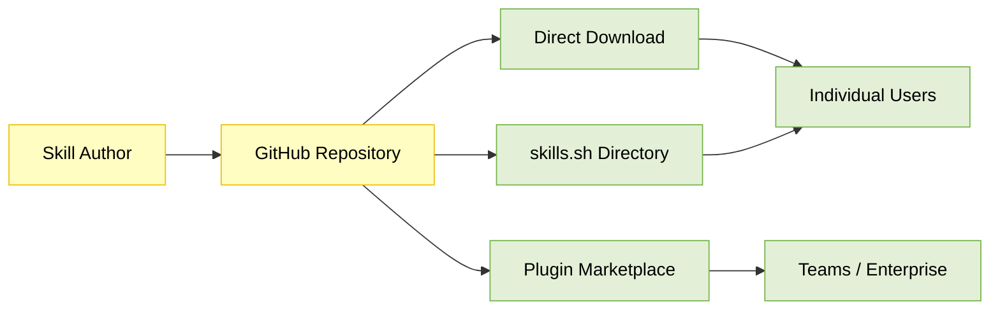

A platform engineering team at a mid-size SaaS company had a recurring problem. Every time someone asked their coding agent to set up a new microservice, the agent produced a slightly different project structure. Different logging patterns, different error handling, inconsistent CI configs. The team had documented their conventions in a wiki, but the agent could not read it at the right moment. They needed a way to package that institutional knowledge so any agent, in any conversation, could apply it automatically.

That problem, repeated across thousands of teams and dozens of agent products, is what Agent Skills were built to solve.

## What changed

Agent Skills started as an internal format at Anthropic for giving Claude structured, reusable capabilities. In early 2026, Anthropic released it as an open standard, and adoption moved fast. Over 30 agent products now support the format, including Cursor, Gemini CLI, OpenAI Codex, VS Code, Claude Code, Roo Code, OpenHands, Goose, JetBrains Junie, and others ([agentskills.io](https://agentskills.io)). The breadth of adoption is what makes this interesting: a Skill written for one agent can work across the ecosystem.

The core idea is simple: a Skill is a folder. At minimum, it contains a single file called `SKILL.md` with YAML frontmatter and Markdown instructions. The frontmatter tells the agent what the Skill does and when to use it. The Markdown body tells the agent how to do it. Optional subdirectories (`scripts/`, `references/`, `assets/`) provide executable code, documentation, and static resources that the agent can access as needed ([Agent Skills Specification](https://agentskills.io/specification)).

```
code-review/
├── SKILL.md              # Required: instructions + metadata
├── scripts/
│   └── lint_check.py     # Optional: executable code
├── references/
│   └── style-guide.md    # Optional: detailed documentation
└── assets/
    └── template.md       # Optional: templates, schemas
```

This is not a plugin system, a function-calling schema, or a prompt template. Skills sit at a different layer. They provide procedural knowledge: the workflows, best practices, and domain expertise that turn a general-purpose agent into a specialist for a specific task.

## Background: why agents need procedural knowledge

Most agent architectures give the model access to tools (via function calling or MCP) and context (via system prompts or retrieval). These solve the "what can the agent do" and "what does the agent know" questions. But they leave a gap: "how should the agent do it."

Consider a financial compliance workflow. An MCP server can give the agent access to transaction data and sanctions lists. A system prompt can tell it to be careful. But neither teaches the agent the specific sequence of checks, the order of operations, the edge cases, or the rollback procedures that a compliance officer would follow. That procedural knowledge either gets re-explained in every prompt, or it gets hard-coded into application logic where it becomes brittle and invisible.

Skills fill this gap by providing a standardized container for procedural knowledge that agents can discover and load dynamically ([Agent Skills Specification](https://agentskills.io/specification)).

A useful analogy from the original engineering blog: MCP provides the professional kitchen (access to tools, ingredients, equipment), while Skills provide the recipes (step-by-step instructions on how to create something valuable). Together, they let users accomplish complex tasks without figuring out every step themselves ([Equipping Agents for the Real World](https://www.anthropic.com/engineering/equipping-agents-for-the-real-world-with-agent-skills)).

## Skills vs. the alternatives

Skills are not the only way to customize agent behavior. System prompts, MCP servers, and subagents each solve different problems. The table below clarifies where each mechanism fits and where Skills fill a gap the others leave open ([Skills Explained](https://claude.com/blog/skills-explained)).

|                            | Skills                                           | System prompts                 | MCP servers                       | Subagents                             |
| -------------------------- | ------------------------------------------------ | ------------------------------ | --------------------------------- | ------------------------------------- |
| **What it provides**       | Procedural knowledge (workflows, best practices) | Moment-to-moment instructions  | Tool connectivity and data access | Task delegation with isolated context |
| **Persistence**            | Across conversations                             | Single conversation            | Continuous connection             | Across sessions                       |
| **When it loads**          | Dynamically, only when relevant                  | Every turn (always in context) | Always available                  | When invoked                          |
| **Can include code**       | Yes (bundled scripts)                            | No                             | Yes (server-side)                 | Yes (agent logic)                     |
| **Portable across agents** | Yes (open standard)                              | No (product-specific)          | Yes (open standard)               | No (product-specific)                 |
| **Token cost when idle**   | ~100 tokens (metadata only)                      | Full prompt cost every turn    | Minimal (tool definitions)        | None until invoked                    |
| **Best for**               | Reusable domain expertise                        | Quick, one-off requests        | Connecting to external data/tools | Specialized tasks needing isolation   |

The key distinction: system prompts tell the agent what to do right now, MCP tells the agent what it can access, subagents handle delegated tasks, and Skills teach the agent how to do something well, persistently and portably.

## How progressive disclosure works

The most important design decision in the Skills architecture is progressive disclosure: a three-level loading system that minimizes token usage while maintaining specialized expertise.

**Level 1: Metadata (~100 tokens per Skill).** The YAML frontmatter, containing only the `name` and `description` fields, is loaded into the agent's system prompt at startup. This lightweight approach means you can install many Skills without context penalty. The agent knows each Skill exists and when to use it, but pays almost nothing for that awareness.

```yaml
---
name: code-review
description: >
  Reviews code for bugs, security vulnerabilities, and performance issues.
  Use when user asks for code review, PR feedback, or security audit.
---
```

**Level 2: Instructions (<5,000 tokens).** When the agent determines a Skill is relevant to the current task, it reads the full `SKILL.md` body from the filesystem. Only then do the instructions enter the context window. This is the "recipe," the step-by-step guidance for completing the task.

**Level 3: Resources (as needed).** Additional files bundled within the Skill directory, such as scripts, reference documents, and templates, are loaded only when the instructions reference them. An executable script like `validate_form.py` runs via the agent's shell, and only its output (not its source code) enters the context. This makes scripts far more token-efficient than having the agent generate equivalent code on the fly ([Agent Skills Specification](https://agentskills.io/specification)).

| Level        | When loaded             | Token cost            | Content                                             |
| ------------ | ----------------------- | --------------------- | --------------------------------------------------- |
| Metadata     | Always (startup)        | ~100 tokens per Skill | `name` and `description` from YAML frontmatter      |
| Instructions | When Skill is triggered | <5,000 tokens         | SKILL.md body with workflows and guidance           |
| Resources    | As needed               | Effectively unlimited | Scripts, references, assets accessed via filesystem |

The practical consequence: you can bundle comprehensive API documentation, large datasets, or extensive examples in a Skill without any context penalty for content that is not used in a given conversation.

<Image
  alt="Skills and the Context Window"
  src="/static/images/blogs/agent-skills/skills-and-the-context-window.png"
  width={900}
  height={520}
  className="mx-auto"
/>

<DiagramSubtitle>
  Short snippets from each Skill's metadata are appended to the system prompt. When triggered, the
  agent reads SKILL.md from the filesystem via Bash, then follows any references to load additional
  files on demand.
</DiagramSubtitle>

<Image
  alt="Agent + Skills + Computer"
  src="/static/images/blogs/agent-skills/agent-skills-architecture.png"
  width={900}
  height={520}
  className="mx-auto"
/>

<DiagramSubtitle>
  The agent configuration (equipped Skills and MCP servers) maps to Skill directories living in the
  agent VM's filesystem, where each Skill folder contains SKILL.md and optional supporting files.
</DiagramSubtitle>

## The SKILL.md specification

The Agent Skills format is deliberately minimal. A valid Skill requires exactly one file: `SKILL.md`, containing YAML frontmatter followed by Markdown content ([Agent Skills Specification](https://agentskills.io/specification)).

**Required frontmatter fields:**

- `name`: 1-64 characters, lowercase alphanumeric and hyphens only (kebab-case). Must match the parent directory name.
- `description`: 1-1,024 characters. Must describe both what the Skill does and when to use it, including specific trigger phrases.

**Optional frontmatter fields:**

- `license`: License name or reference to a bundled license file.
- `compatibility`: Environment requirements (intended product, system packages, network access).
- `metadata`: Arbitrary key-value mapping for author, version, and custom properties.
- `allowed-tools`: Space-delimited list of pre-approved tools the Skill may use (experimental).

The Markdown body after the frontmatter contains the actual instructions. There are no format restrictions. Best practice is to structure instructions with step-by-step workflows, concrete examples of inputs and outputs, and common edge cases ([The Complete Guide to Building Skills for Claude](https://claude.ai)).

Here is a minimal but functional example:

```yaml
---
name: sprint-planning
description: >
  Plans development sprints with task estimation and prioritization.
  Use when user mentions "sprint planning", "create sprint", or
  "plan iteration". Works with Linear and Jira via MCP.
---

# Sprint Planning

## Steps

1. Fetch current backlog from project management tool
2. Analyze team velocity from previous 3 sprints
3. Suggest task prioritization using MoSCoW method
4. Create tasks with estimates and assignees

## Example

User says: "Help me plan the next sprint for the auth team"

Actions:
1. Pull open tickets tagged `auth-team` from Linear
2. Calculate average velocity (story points per sprint)
3. Prioritize by impact and effort
4. Create sprint with balanced workload

## Edge cases

- If no historical velocity data exists, default to 20 points
- If backlog has fewer items than capacity, flag for grooming
```

## What this means in practice

Skills unlock three concrete workflow patterns that were previously difficult to achieve reliably with prompts alone.

**Pattern 1: Document and asset creation.** Skills can embed style guides, brand standards, template structures, and quality checklists so that agents produce consistent, high-quality output. Some agent platforms ship pre-built Skills (for example, Anthropic provides Skills for PowerPoint, Excel, Word, and PDF generation), but any team can create similar document-creation Skills for their own agent of choice ([Agent Skills Specification](https://agentskills.io/specification)).

**Pattern 2: Workflow automation.** Multi-step processes benefit from Skills that define explicit step ordering, validation gates at each stage, and rollback instructions for failures. The `skill-creator` Skill, for example, walks users through use case definition, frontmatter generation, instruction writing, and validation in a structured loop ([The Complete Guide to Building Skills for Claude](https://claude.ai)).

**Pattern 3: MCP enhancement.** Skills add a knowledge layer on top of tool connectivity. Without Skills, users connect an MCP server and then have to figure out the optimal workflows themselves. With Skills, those workflows activate automatically. Sentry's `sentry-code-review` Skill, for example, coordinates multiple MCP calls to analyze bugs in GitHub pull requests using Sentry's error monitoring data ([The Complete Guide to Building Skills for Claude](https://claude.ai)).

The key differentiator from prompts is persistence and portability. A prompt is ephemeral, scoped to a single conversation. A Skill is a versioned artifact that loads on demand across conversations, across projects, and (because it is an open standard) across agent products.

## The distribution ecosystem

Skills need a way to reach users. Three distribution channels have emerged.

**Direct installation.** Users download a Skill folder and place it where their agent expects to find Skills. The exact path varies by product: some agents look in a `.claude/skills/` or `.cursor/skills/` directory, others accept zip uploads through a settings panel, and API-based agents support programmatic upload endpoints. Because a Skill is just a folder, any file-sharing mechanism works ([Agent Skills Specification](https://agentskills.io/specification)).

**Plugin marketplaces.** Several agent products support marketplace-based distribution, where a Git repository contains a catalog of plugins (which can include Skills). Teams add a marketplace and install individual plugins with version pinning, automatic updates, and release channels. Some platforms allow admins to restrict users to approved marketplaces for enterprise governance ([Claude Code Plugin Marketplaces](https://code.claude.com/docs/en/plugin-marketplaces)).

**Community directories.** The [skills.sh](https://skills.sh) directory, built by Vercel Labs, provides a public leaderboard and CLI (`npx skills add owner/repo`) for discovering and installing Skills across any compatible agent. Rankings are driven by anonymous installation telemetry ([skills.sh](https://skills.sh/docs)).



## Building your first Skill: a practical walkthrough

Start with a concrete use case, not an abstraction. Identify 2-3 tasks you want the agent to handle, then work backward to the Skill structure ([The Complete Guide to Building Skills for Claude](https://claude.ai)).

**Step 1: Define the use case.**

Ask: What does the user want to accomplish? What multi-step workflow is required? What domain knowledge should be embedded?

**Step 2: Write the frontmatter.**

The `description` field is the most critical part of the entire Skill. It determines when the agent loads the Skill. A good description includes what the Skill does, when to use it, and specific keywords or phrases the user might say.

```yaml
---
name: api-documentation
description: >
  Generates API reference documentation from code annotations.
  Use when user says "document this API", "generate API docs",
  or "create endpoint documentation". Supports REST and GraphQL.
---
```

**Step 3: Write instructions using progressive disclosure.**

Keep `SKILL.md` under 5,000 tokens (~500 lines). Move detailed reference material to `references/`. Link to specific files only when the agent needs them.

**Step 4: Test triggering.**

Run 10-20 test queries that should and should not trigger the Skill. Ask the agent: "When would you use the [skill-name] Skill?" The agent will quote the description back. Adjust based on what is missing or overly broad.

**Step 5: Iterate based on signals.**

Under-triggering (Skill does not load when it should): add more detail and trigger phrases to the description. Over-triggering (Skill loads for unrelated queries): add negative triggers or narrow the scope. Execution issues (inconsistent results): improve instructions, add error handling, bundle validation scripts.

## Limitations and failure modes

**Cross-surface availability.** Skills do not automatically sync across agent products or even across different surfaces within the same product. A Skill installed in one coding agent is not automatically available in another. Teams must manage distribution separately for each environment they use.

**Sharing scope varies by product.** Different agent products handle Skill sharing differently. Some scope Skills to individual users, others share them workspace-wide, and filesystem-based agents may support both personal and project-level Skill directories. There is no universal sharing mechanism defined by the standard itself.

**Runtime environment constraints.** What a Skill's bundled scripts can do depends on the agent's runtime. Some agents run in sandboxed environments with no network access and limited package availability. Others give Skills full system access. The specification does not mandate a runtime, so Skill authors should document their requirements in the `compatibility` field and design for the most constrained expected environment.

**Security surface.** Skills provide instructions and executable code. A malicious Skill can direct an agent to invoke tools or execute code in ways that do not match the Skill's stated purpose. Only use Skills from trusted sources, those you created yourself or from verified publishers, and audit all bundled files before use ([Agent Skills Specification](https://agentskills.io/specification)).

**Directory convention fragmentation.** The open standard promotes a shared `.agents/` directory for Skill discovery, but several products still use their own conventions: `.roo/` for Roo Code, `.cursor/` for Cursor, `.claude/` for Claude Code, and so on. In practice, teams targeting multiple agents may need to duplicate or symlink Skills across these directories. Until products converge on a single discovery path, the "write once, run anywhere" promise has a practical asterisk.

**Interoperability is early.** The open standard is adopted by 30+ products, but the depth of integration varies. Some agents load SKILL.md content natively with full progressive disclosure; others treat it as a reference file without dynamic triggering. Behavior may differ across implementations, and there is no conformance test suite yet.

## Conclusion

Agent Skills represent a quiet but meaningful shift in how procedural knowledge gets packaged for AI agents. The format is simple—a folder, a Markdown file, some optional scripts—but the implications are real. Teams can now version, distribute, and load domain expertise the same way they manage code, without re-explaining workflows in every prompt or burying conventions in application logic.

The ecosystem is still early. Open questions remain around evaluation tooling (how do you measure trigger accuracy at scale?), composition semantics (what happens when two loaded Skills give conflicting instructions?), versioning notifications, relevance-based discovery beyond install-count rankings, and the practical depth of cross-agent portability across all 30+ adopting products.

None of that should stop you from starting. The path is straightforward:

1. **Start with one workflow.** Pick the task your team explains most often in prompts. Write a Skill for it. Test it against 10 variations of how a user might phrase the request.
2. **Use progressive disclosure from the start.** Keep SKILL.md focused on core instructions. Move detailed documentation, schemas, and reference files to separate directories.
3. **Distribute through version control.** Host Skills in Git repositories. Use plugin marketplaces or community directories like [skills.sh](https://skills.sh) for team and public distribution. Pin to specific versions for production stability.

The agents that get reliable results in production will not be the ones with the most elaborate prompts. They will be the ones backed by Skills that package the right procedural knowledge, load it at the right moment, and keep growing as the team's expertise grows.

## References

- [Agent Skills Specification](https://agentskills.io/specification)
- [Anthropic Agent Skills Documentation](https://docs.anthropic.com/en/docs/agents-and-tools/agent-skills)
- [Anthropic Engineering Blog: Equipping Agents for the Real World with Agent Skills](https://www.anthropic.com/engineering/equipping-agents-for-the-real-world-with-agent-skills)
- [The Complete Guide to Building Skills for Claude](https://claude.ai) (Anthropic, PDF guide)
- [Agent Skills GitHub Repository](https://github.com/agentskills/agentskills)
- [Skills Explained: How Skills Compare to Prompts, Projects, MCP, and Subagents](https://claude.com/blog/skills-explained)
- [skills.sh: The Agent Skills Directory](https://skills.sh)
- [Claude Code Plugin Marketplaces](https://code.claude.com/docs/en/plugin-marketplaces)
- [Anthropic Skills Library on GitHub](https://github.com/anthropics/skills)
