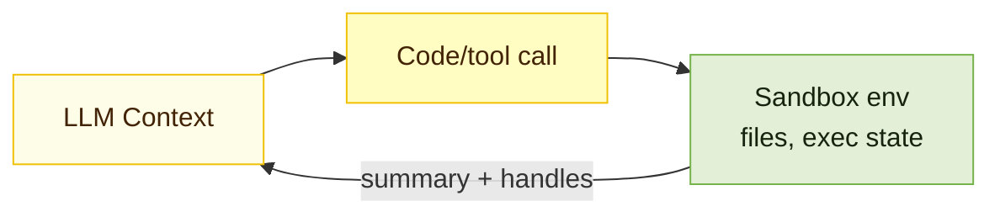
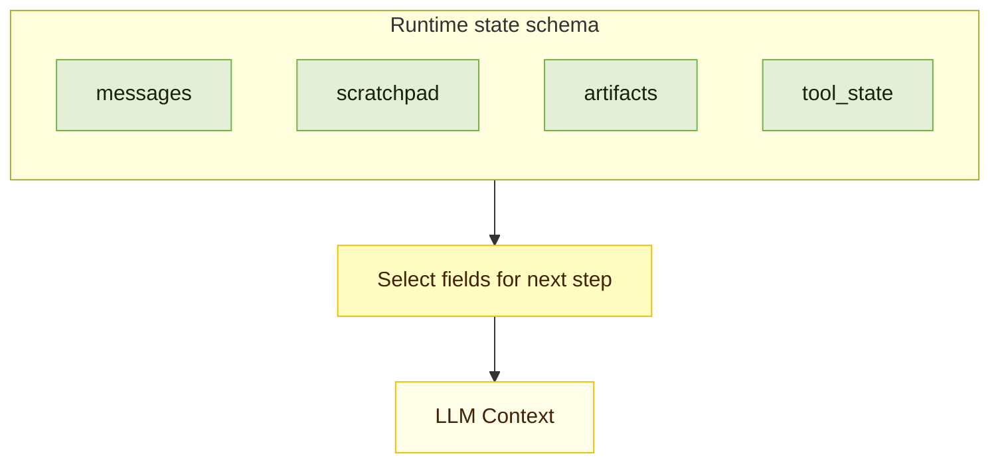

After years of focusing on "prompt engineering," the frontier of applied AI has shifted. Building reliable agents is now less about finding the perfect phrase and more about answering a broader systems question: **what configuration of context is most likely to generate the model’s desired behavior?**

**Context** refers to the set of tokens included when sampling from an LLM. The **engineering** problem is optimizing the utility of those tokens against the model's finite attention budget. Effectively wrangling agents requires _thinking in context_: considering the holistic state available to the model at any given time—system instructions, tools, message history, and data—and managing how that state evolves loop after loop.

A useful analogy is _mise en place_. Prompt engineering is writing the recipe (the static instructions). Context engineering is managing the kitchen during service (the dynamic state). Before service starts, a chef has their station set: chopped onions, reduced sauces, and tools ready. That prep work—that curated context—is what makes the output consistent even when the heat is on.

LLMs are inherently stateless. For a single API call, the context window is the model's entire universe. **Context engineering** is the system design that decides what goes into that universe and, more importantly, what stays out.

<Image
  alt="Prompt Engineering vs Context Engineering"
  src="/static/images/blogs/context-engineering-for-ai-agents/anthropic_prompt-engineering-vs-context-engineering.png"
  width={900}
  height={520}
  className="mx-auto"
/>

<DiagramSubtitle>Prompt Engineering vs Context Engineering (Source: Anthropic)</DiagramSubtitle>

## The explosion of task length

We are asking agents to do more than ever before. According to METR, the length of tasks AI can do is doubling every 7 months. We have moved from models limited to 4-second tasks to agents capable of autonomously completing tasks that take expert humans over an hour [12].

<Image
  alt="The length of tasks AI can do is doubling every 7 months"
  src="/static/images/blogs/context-engineering-for-ai-agents/metr_length-of-ai-task.png"
  width={900}
  height={520}
  className="mx-auto"
/>

<DiagramSubtitle>Task length capacity is growing exponentially (Source: METR)</DiagramSubtitle>

As task horizons expand, the volume of state an agent must track grows with it. This creates a pressure cooker for context. The practical decision rule becomes clear: **If the next step does not need it, keep it in state or memory, not in the prompt.**

## Why longer context windows do not magically solve the problem

Longer windows help, but they also tempt us into sloppy behavior: “Screw it, throw it all in.” The problem is that tokens are not free.

- **Cost and latency** grow with every extra token you send.
- **Noise** grows too: stale facts, conflicting instructions, and verbose tool logs.
- **Quality can degrade** as input gets longer, even when the task itself is simple.

Recent evaluations show that while models excel at "Needle-in-a-Haystack" retrieval, they degrade as input length grows—especially when "distractors" (irrelevant information) are present. The bottleneck isn't just retrieval; it is reasoning amidst noise.

In production, long contexts tend to fail in five recurring ways:

- **Context poisoning**: mistakes stay in context and get reused.
- **Context distraction**: model over-focuses on history vs. training data.
- **Context confusion**: irrelevant details drown out signal.
- **Context clash**: new tools or instructions conflict with old ones.
- **Context rot**: performance degrades as context grows.

When an agent starts to drift, you can usually recover by doing one of four things: **write** important state somewhere durable, **select** only the evidence needed for the next step, **compress** what you keep so signal fits in the window, or **isolate** different kinds of context so they do not collide.

<div className="mx-auto grid max-w-5xl gap-6 md:grid-cols-2">
<div>
```mermaid
flowchart TB
  classDef primary fill:#fffdc2,stroke:#efc003,stroke-width:1px,color:#432305;
  classDef secondary fill:#e3f0d7,stroke:#75b34a,stroke-width:1px,color:#16240f;
  classDef ctx fill:#fefde8,stroke:#efc003,stroke-width:1px,color:#432305;

subgraph W["Write Context"]
direction TB
W_CTX["LLM Context"]:::ctx
W_LTM["Long-term memories<br/>(across sessions)"]:::secondary
W_SP["Scratchpad<br/>(within session)"]:::secondary
W_STATE["State<br/>(within session)"]:::secondary
W_CTX -->|write out| W_LTM
W_CTX -->|write out| W_SP
W_CTX -->|write out| W_STATE
end

````
</div>

<div>
```mermaid
%%{init: {"themeVariables": {"fontSize": "18px"}}}%%
flowchart TB
  classDef primary fill:#fffdc2,stroke:#efc003,stroke-width:1px,color:#432305;
  classDef secondary fill:#e3f0d7,stroke:#75b34a,stroke-width:1px,color:#16240f;
  classDef ctx fill:#fefde8,stroke:#efc003,stroke-width:1px,color:#432305;

  subgraph S["Select Context"]
    direction TB
    S_CTX["LLM Context"]:::ctx
    S_TOOLS["Relevant tools"]:::secondary
    S_SP["Scratchpad"]:::secondary
    S_LTM["Long-term memory"]:::secondary
    S_KNOW["Knowledge base"]:::secondary
    S_TOOLS -->|retrieve| S_CTX
    S_SP -->|retrieve| S_CTX
    S_LTM -->|retrieve| S_CTX
    S_KNOW -->|retrieve| S_CTX
  end
````

</div>

<div>
```mermaid
flowchart TB
  classDef primary fill:#fffdc2,stroke:#efc003,stroke-width:1px,color:#432305;
  classDef secondary fill:#e3f0d7,stroke:#75b34a,stroke-width:1px,color:#16240f;
  classDef ctx fill:#fefde8,stroke:#efc003,stroke-width:1px,color:#432305;

subgraph C["Compress Context"]
direction TB
C_RAW["Context (before)"]:::secondary
C_SUM["Summarize<br/>(retain relevant tokens)"]:::primary
C_TRIM["Trim<br/>(remove irrelevant tokens)"]:::primary
C_CTX["LLM Context (after)"]:::ctx
C_RAW --> C_SUM --> C_CTX
C_RAW --> C_TRIM --> C_CTX
end

````
</div>

<div>
```mermaid
flowchart TB
  classDef primary fill:#fffdc2,stroke:#efc003,stroke-width:1px,color:#432305;
  classDef secondary fill:#e3f0d7,stroke:#75b34a,stroke-width:1px,color:#16240f;
  classDef ctx fill:#fefde8,stroke:#efc003,stroke-width:1px,color:#432305;

  subgraph I["Isolate Context"]
    direction TB
    I_CTX["LLM Context"]:::ctx
    I_STATE["Partition in state<br/>(separate fields)"]:::secondary
    I_SBX["Hold in sandbox<br/>(artifacts, exec state)"]:::secondary
    I_MA["Partition across agents<br/>(separate windows)"]:::secondary
    I_OK["Lower clash risk<br/>cleaner prompts"]:::primary
    I_STATE --> I_OK
    I_SBX --> I_OK
    I_MA --> I_OK
    I_OK --> I_CTX
  end
````

</div>
</div>

<DiagramSubtitle>The four pillars of context engineering</DiagramSubtitle>

## Strategy 1: Write context (persist outside the prompt)

Writing context is about durability. The context window is working memory. If something needs to survive past the next model call, it has to live somewhere else.

In practice, most "write context" decisions fall into three places: **scratchpads** (working memory), **artifacts** (heavy objects stored outside the prompt), and **memory** (durable cross-session context).

### Scratchpads (in-session)

Scratchpads are where agents take notes while they work. They are a place to keep:

- **Current plan and progress**: where are we in the loop?
- **Constraints and decisions**: facts that should not be re-litigated every turn.
- **Intermediate results**: partial outputs that frame the next step.
- **Tool output summaries**: distilled results, especially when the raw output is verbose.

Implementations vary, but the idea stays the same:

- Write to a file (good for handoffs and larger artifacts)
- Write to a runtime state object (easy to read and write in orchestration frameworks)
- Checkpoint that state so it survives tool calls and long runs

### Artifacts (heavy state, persisted outside the prompt)

Artifacts are the bulky stuff: logs, long tool outputs, tables, intermediate files, screenshots, and anything you might want to reference later without paying the token cost every turn. Use them to bridge the gap between sessions: a file generated today can be the context for a task tomorrow.

The key idea is separation. Keep large blobs out of the prompt, then pull back only what you need, when you need it. Think of artifacts as the agent’s backpack, not its working memory.

### Memory (cross-session)

Memory is what should follow the user or project across sessions: preferences, stable facts, recurring context. Keep it curated. You do not want to “remember the transcript,” you want a small set of items that reliably changes what the agent does next time.

It helps to separate memory by recall scope:

- **Short-term memory (thread-scoped)** tracks an ongoing conversation. In many agent frameworks, this lives in the agent’s state and is persisted via checkpoints so you can resume the thread. This is where scratchpads, retrieved documents, and “what we have done so far” usually live.
- **Long-term memory (cross-session)** stores user or app level information across threads. It can be recalled in any future session, if it is relevant enough to earn its way into the prompt.

Long-term memory also comes in different flavors. A simple mapping that tends to be practical:

| Memory type    | What it stores         | Agent example                                                |
| -------------- | ---------------------- | ------------------------------------------------------------ |
| **Semantic**   | Facts and preferences  | “User prefers short answers”, “Project uses Next.js”         |
| **Episodic**   | Past experiences       | A successful previous run, turned into a reusable example    |
| **Procedural** | Rules and instructions | The agent’s operating guidelines, or a refined system prompt |

This diagram shows the split between short-term, checkpointed conversation memory and long-term memory kept in a **separate logical store** (often within the same database) that is selectively retrieved into the model.

<MemoryArchitecture />

<DiagramSubtitle>Short-term checkpoints vs. long-term memory store</DiagramSubtitle>

In long-horizon work, keep the checkpointed thread lean and promote only durable facts or preferences into the long-term store. That way the short-term window stays focused on the current task, while the long-term store carries what should persist across sessions and can be retrieved when it actually matters.

#### Hot path vs background writes

Once you decide something should become long-term memory, you must choose when to write it. The trade-off is simple: **Hot path** writes (synchronous) ensure immediate recall but add latency; **Background** writes (asynchronous) keep the loop fast but risk staleness.

| Write mode | When it runs          | Upside                                        | Cost                              |
| ---------- | --------------------- | --------------------------------------------- | --------------------------------- |
| Hot path   | During the step loop  | Immediate recall, easier to explain to users  | More latency, more cognitive load |
| Background | Outside the step loop | Lower latency, cleaner separation of concerns | Needs triggers, can lag behind    |

<ProcessFlow />

<DiagramSubtitle>Synchronous vs. asynchronous memory writes</DiagramSubtitle>

## Strategy 2: Select context (retrieve only what matters now)

Selection is relevance under a budget. For each model call, aim to include:

1. **Task frame**: goal, constraints, what "done" means for this step.
2. **Evidence**: the minimum facts needed to decide the next action.
3. **Action space**: only the tools relevant right now.

Implementing this requires moving away from the default `messages = history` pattern. Instead, you build the context dynamically for each step.

In practice, "selecting context" is not one retrieval. It is a small set of targeted retrieval passes, each pulling from a different store:

- **Conversation state**: thread history, pinned items, rolling summary.
- **Relevant tools**: what the agent is allowed to do right now.
- **Scratchpad**: what the agent already discovered in this run.
- **Long-term memory**: what the agent should remember across runs.
- **Relevant knowledge**: what the agent should reference from docs, data, or the web.

### Conversation state (short-term, thread-scoped)

A thread defines the conversation boundary, but it should not dictate prompt size. Store the full history in the thread so you can resume and audit, then inject only a curated slice into the next call.

A simple default is:

- **Recent turns**: the last N messages.
- **Pinned items**: current goal, constraints, and decisions.
- **Rolling summary**: a digest of older context that has been pruned.

```mermaid
flowchart TB
  classDef primary fill:#fffdc2,stroke:#efc003,stroke-width:1px,color:#432305;
  classDef secondary fill:#e3f0d7,stroke:#75b34a,stroke-width:1px,color:#16240f;

  Q["Current step goal"]:::primary --> SEL["Select context"]:::primary

  SEL --> HIST["Retrieve from thread<br/>(short-term state)"]:::secondary
  SEL --> TOOLS["Retrieve relevant tools<br/>(tool loadout)"]:::secondary
  SEL --> SP["Retrieve from scratchpad<br/>(in-session state)"]:::secondary
  SEL --> MEM["Retrieve long-term memory<br/>(cross-session)"]:::secondary
  SEL --> KNOW["Retrieve relevant knowledge<br/>(RAG)"]:::secondary

  HIST --> PAY["Assembled payload"]:::primary
  TOOLS --> PAY["Assembled payload"]:::primary
  SP --> PAY
  MEM --> PAY
  KNOW --> PAY

  PAY --> LLM["LLM call"]:::primary
```

<DiagramSubtitle>Context selection from multiple sources</DiagramSubtitle>

### Retrieve relevant tools

Tools are part of context too. A tool definition is not just an API schema, it is also an affordance. If you show the model too many tools at once, it can spend attention sorting them out instead of doing the task. In one reported evaluation (prompting DeepSeek-v3), tool overlap became a problem above 30 tools, and beyond 100 tools the model was virtually guaranteed to fail the tool selection test without dynamic tool selection [6]. At scale, token burn is just as bad: large tool catalogs can consume tens of thousands of tokens before the agent even reads the user request.

The practical technique is a tool loadout:

- Maintain a catalog of tools with short, crisp descriptions.
- Retrieve only the small subset of tools relevant to the current step.
- Hide the rest, not because they are “bad”, but because they are not earning their keep right now.

Two upgrades make loadouts work at scale:

- **Tool search**: keep only a search capability + a few always-on tools in context, and defer the rest. The agent discovers and loads 3-5 matching tools on-demand instead of carrying 50+ definitions upfront.
- **Programmatic tool calling**: when a step involves many calls or large intermediate results, orchestrate tools in code so only the final output enters the model’s context.

Here is the impact of tool search on context usage. In a traditional approach, loading a full catalog of MCP tools can consume massive amounts of space (e.g., 72k tokens), leaving little room for reasoning. By switching to a tool search pattern—where only a search tool and discovered tools are loaded—you can reclaim almost the entire context window (e.g., dropping usage to under 9k tokens). The agent searches the index first, and only pays the token cost for the full schemas of the tools it actually intends to use.

<Image
  alt="Tool search narrows the catalog before loading full tool schemas"
  src="/static/images/blogs/context-engineering-for-ai-agents/anthropic_tool-search.png"
  width={900}
  height={520}
  className="mx-auto"
/>

<DiagramSubtitle>Tool search narrows the catalog before loading full tool schemas</DiagramSubtitle>

### Retrieve relevant skills

Skills are modular, filesystem-based bundles of instructions, scripts, and reference material. Like tools, they are part of context selection: load only the skills that help with the current step, and keep the rest out of the prompt. Skill selection is a retrieval step in its own right: query the skill catalog by metadata (name + description), rank by task fit, and load only the smallest set that covers the current goal.

Skills support progressive disclosure. At startup, load only **metadata** (name + description). When relevant, actively load the **instructions** (the `SKILL.md`). For complex skills, perform a **deep dive** by reading specific script files only when the task demands it. This keeps the "menu" light while allowing the agent to order the full "meal" on demand.

This keeps the context window small: the agent only carries the "menu" (metadata) in its head, and orders the "meal" (instructions) only when it decides to eat.

<Image
  alt="Skills are pulled into context only when triggered by the task"
  src="/static/images/blogs/context-engineering-for-ai-agents/anthropic_skills.png"
  width={900}
  height={520}
  className="mx-auto"
/>

<DiagramSubtitle>Skills enter the context window only when triggered</DiagramSubtitle>

Once a skill is loaded, treat its instructions like a mini playbook: follow the workflow it defines, and only open deeper resources (guides, templates, scripts) when the current step requires them. This keeps the prompt lean while still letting you tap into richer, domain-specific guidance on demand.

Here is a sample skill as it appears in practice:

<Image
  alt="Sample skill layout with SKILL.md and referenced files"
  src="/static/images/blogs/context-engineering-for-ai-agents/anthropic_sample_skill.png"
  width={900}
  height={520}
  className="mx-auto"
/>

<DiagramSubtitle>Example skill structure</DiagramSubtitle>

For concrete examples, see Anthropic's open-source agent skills repository: https://github.com/anthropics/skills.

### Retrieve from scratchpad

Scratchpad retrieval is the easiest win because it is already “yours”. It is the agent’s own intermediate state: constraints, partial results, open questions, and notes from prior tool calls.

Two patterns make scratchpads usable:

- **Structured buckets**: organize by constraints, plan, and intermediate facts, not an unbounded wall of text.
- **Pinned items**: prioritize the current goal, non-negotiable constraints, and latest decisions over recency alone.

### Retrieve long-term memory

Long-term memory is what you want to carry across sessions, without dragging along the full transcript. The technique is not “retrieve everything”. It is “retrieve the right memories, under a budget”.

In practice, long-term memory is usually a mix of:

- **Stable preferences**: style, tone, and format defaults.
- **Stable facts**: user profile, environment details, and recurring project context.
- **Commitments**: agreed-upon goals and definitions of "done."

The retrieval trick is to blend relevance, recency, and importance, so a core preference can survive time decay, while stale trivia quietly disappears.

How you load long-term memory matters as much as what you store. Some systems inject a curated memory block before the first model call, others retrieve memories on demand in the middle of a run.

“Memory” can be retrieved either by the model or for the model.

- In "memory as a tool", long-term memory lives in a store and is fetched via an explicit read (the agent decides when to call it).
- In "memory as preflight", long-term memory lives in configuration or rule files that are automatically loaded into the session context by the client before the first model call. The retrieval still happens, it is just proactive and outside the model's action loop. This is how Claude Code does it: it loads project and user memory files automatically at startup (for example `CLAUDE.md`), then uses them as baseline context.

<div className="mx-auto grid max-w-3xl gap-6 md:grid-cols-2">
<div>
```mermaid
flowchart TB
  classDef primary fill:#fffdc2,stroke:#efc003,stroke-width:1px,color:#432305;
  classDef secondary fill:#e3f0d7,stroke:#75b34a,stroke-width:1px,color:#16240f;
  classDef ctx fill:#fefde8,stroke:#efc003,stroke-width:1px,color:#432305;

subgraph TOOL["Retrieve BY the Model"]
direction TB
T_CTX["Context"]:::ctx --> T_LLM["LLM decides<br/>to read memory"]:::primary
T_LLM --> T_CALL["Call memory tool"]:::secondary
T_CALL --> T_STORE["Vector / SQL Store"]:::secondary
T_STORE -->|return content| T_CTX
end

````
</div>

<div>
```mermaid
flowchart TB
  classDef primary fill:#fffdc2,stroke:#efc003,stroke-width:1px,color:#432305;
  classDef secondary fill:#e3f0d7,stroke:#75b34a,stroke-width:1px,color:#16240f;
  classDef ctx fill:#fefde8,stroke:#efc003,stroke-width:1px,color:#432305;

subgraph PRE["Retrieve FOR the Model"]
direction TB
P_CLIENT["Client / Runtime"]:::primary --> P_READ["Read config files<br/>(e.g., CLAUDE.md)"]:::secondary
P_READ --> P_INJECT["Inject into<br/>System Prompt"]:::secondary
P_INJECT --> P_CTX["Context"]:::ctx
P_CTX --> P_LLM["LLM starts task<br/>(already knows rules)"]:::primary
end
````

</div>
</div>

If you want the preflight ergonomics in your own agent, treat “load memory” as a step that runs before the first model call (and occasionally re-runs when scope changes), then inject the curated result into system instructions under a strict token budget.

| Pattern                           | Who triggers recall | Latency         | Best for                          |
| --------------------------------- | ------------------- | --------------- | --------------------------------- |
| Proactive injection (client-side) | Runtime or client   | Lowest per step | Stable preferences, project rules |
| Reactive tool call (agent-side)   | The model           | Adds a tool hop | Episodic recall, sparse memory    |

In practice, proactive injection is just “prepend a curated memory block to system instructions”. Memory as a tool is “when you need a memory, query the store, then inject the result for this step”.

### Retrieve relevant knowledge (RAG)

Retrieval-Augmented Generation (RAG) gives agents an open-book test. However, traditional **Passive RAG**—fetching docs based on the user's initial prompt—often fails in multi-step workflows. The user's initial request ("Fix the login bug") rarely contains the keywords needed for step 10 ("OAuth token expiry error").

**Agentic RAG (or Active RAG)** treats retrieval as a tool. The agent encounters a gap in its knowledge and _decides_ to go find the answer.

- **Internal Knowledge**: For static or dense company data (wikis, old tickets, PDFs), agents query a **vector database**. This allows for semantic search over vast archives that cannot be easily queried via standard APIs.
- **Filesystem**: Instead of dumping an entire codebase into context (which is slow and expensive), efficient coding agents like Claude Code use "lightweight identifiers" (file paths) and exploration tools (`ls`, `grep`, `glob`) to find exactly what they need. They don't memorize the repo; they learn how to navigate it.
- **Web Search**: For questions where the answer isn't in your docs, the "database" is the internet. Deep research agents use search tools (`google_search`, `browser`) to perform iterative "multi-hop" retrieval: search, read a page, discover a new term, and search again.
- **Live Connections (MCP)**: For operational, fast-moving data (Google Drive, Linear, Jira, Notion), agents connect directly to the source of truth via the Model Context Protocol (MCP). Unlike a vector database which is often a "stale snapshot," MCP lets the agent read the _current_ state of a ticket or document.

## Strategy 3: Compress context (fight token bloat and context rot)

Compression is what you do when the running session becomes a liability: too expensive, too slow, or too noisy.

There are three common moves, ordered from safest to riskiest:

- **Pruning**: keep recent detail, drop older nuance (good for chatty sessions).
- **Compaction**: keep full fidelity outside the prompt (good for logs, tables, long docs).
- **Summarization**: keep decisions and state, lose exact wording (good for long trajectories and handoffs).

### Pruning

Pruning is often misunderstood as just "deleting old messages." In practice, it takes two forms: **Chronological Pruning** (sliding window) and **Semantic Pruning** (context filtering).

**Chronological Pruning** is the standard sliding window: drop the oldest messages as new ones arrive. It is safe for casual chat, but dangerous for agents because it often deletes the initial user instruction. If you use this, ensure you "pin" the original goal and system instructions so they are strictly immune to the cut.

**Semantic Pruning** is sharper. Instead of dropping whole messages, you prune irrelevant _content_ from within them. Recent research like _Provence_ (2025) treats this as a "sequence labeling" task: dynamically masking out irrelevant sentences or tokens from retrieved context chunks before they enter the model [14]. This is critical for RAG-heavy agents, where a retrieved document might be effective 90% noise. By pruning at the sentence or token level (rather than the document level), you maintain robustness while drastically cutting cost.

<Image
  alt="Example of semantic pruning with Provence"
  src="/static/images/blogs/context-engineering-for-ai-agents/pruning-with-provence-example.png"
  width={900}
  height={520}
  className="mx-auto"
/>

<DiagramSubtitle>
  Semantic pruning removes irrelevant sentences while keeping the "needle"
</DiagramSubtitle>

### Compaction

Compaction is essentially **offloading**. You take a large block of context (like a 50-row database result) and move it to a persistent store (a file or database), replacing it in the chat history with a lightweight pointer (e.g., `Result saved to ID: 4921`). The model sees the pointer and can choose to read the full content again if needed, but it doesn't pay the token tax just to carry it around.

#### Practical example: Tool compaction

Manus, for example, handles the "context rot" of long tool trajectories by compacting "stale" results. Instead of keeping every verbose output in chat history, they write the full content to a file and replace the message with a lightweight pointer (e.g., `Result saved to ID: 4921`). This preserves the data without paying the token tax.

<Image
  alt="Diagram illustrating tool compaction: excessively long tool outputs are written to the file system and replaced with short file references in the chat history to save tokens."
  src="/static/images/blogs/context-engineering-for-ai-agents/tool_compaction.png"
  width={900}
  height={520}
  className="mx-auto"
/>

<DiagramSubtitle>Offloading stale tool results to the file system</DiagramSubtitle>

### Summarization

Summarization is the nuclear option: it replaces the actual history with a synthesized description. It is effectively "lossy compression" applied to your conversation history. Unlike pruning or offloading, summarization is a destructive operation. Once you summarize, the original tokens are gone from the context.

You are trading fidelity for space. This is why it should be the last resort or applied only to 'completed' chunks of work where the details are no longer relevant.

#### Summaries should be state, not prose

A nice paragraph summary is great for humans, and often useless for agents. Agents need state: decisions, constraints, open questions, next steps. When summarizing, force the model to output a structured object (or at least a bulleted list of facts), not a "story" of what happened.

### The Compression Lifecycle

When you combine these techniques, the context usage graph should look like a sawtooth.

1.  **Accumulation**: The agent works, accumulating history (context grows).
2.  **Compaction**: A trigger fires—whether it's a token threshold, a completed subtask, or a period of inactivity. The system compacts stale results (offloading to files), causing usage to drop.
3.  **Summarization**: At major boundaries (e.g., changing topics) or critical limits (e.g., 95% full), a summarization event is triggered. This distills the history into a compact state object. Unlike compaction, this is lossy and irreversible.

<Image
  alt="Context length over time with compaction and summarization"
  src="/static/images/blogs/context-engineering-for-ai-agents/compaction-and-summarization.png"
  width={900}
  height={520}
  className="mx-auto"
/>

<DiagramSubtitle>The lifecycle: Accumulate, Compact, then Summarize</DiagramSubtitle>

### When to compress: Triggers

Three trigger types come up often:

- **Count-based**: when token usage reaches a threshold (reliable, blunt).
- **Time-based**: compress during inactivity (good for chat workloads).
- **Event-based**: compress at semantic boundaries (harder, cleanest output).

If you do not define triggers, compression turns into an emergency response, not a system.

## Strategy 4: Isolate context (prevent collisions and enable parallelism)

Isolation is how you prevent context clash. It shows up at three levels.

```mermaid
flowchart LR
  classDef primary fill:#fffdc2,stroke:#efc003,stroke-width:1px,color:#432305;
  classDef secondary fill:#e3f0d7,stroke:#75b34a,stroke-width:1px,color:#16240f;

  U[User]:::primary --> S1["Session A"]:::secondary
  U --> S2["Session B"]:::secondary

  S1 --> ACL["ACL boundary<br/>user isolation"]:::primary
  S2 --> ACL

  subgraph BUCKETS["Structured buckets (within a session)"]
    HISTB["History"]:::secondary
    TOOLB["Tool outputs"]:::secondary
    SPB["Scratchpad"]:::secondary
    MEMB["Retrieved memories"]:::secondary
  end

  ACL --> BUCKETS --> PAY["Assembled payload"]:::primary

  PAY --> ORCH["Lead agent"]:::primary
  ORCH -->|delegate read| A1["Subagent 1"]:::secondary
  ORCH -->|delegate read| A2["Subagent 2"]:::secondary
  A1 -->|summary + pointers| ORCH
  A2 -->|summary + pointers| ORCH

  ORCH --> SBX["Execution sandbox"]:::secondary
  SBX --> ART["Artifacts"]:::secondary
  ART --> PAY
```

<DiagramSubtitle>Isolation boundaries across sessions and agents</DiagramSubtitle>

### 1) Multi-agent isolation (read in parallel, write with caution)

Multi-agent setups excel at breadth-first **reading**: subagents explore in parallel and report back. However, parallel **writing** is fragile. Conflicting decisions (dependencies, architecture) turn merges into context clashes.

**Rule of thumb**: Parallelize the reading; serialize the writing.

<Image
  alt="Parallel read and single write pattern for multi-agent synthesis"
  src="/static/images/blogs/context-engineering-for-ai-agents/anthropic-multi-agent-system.png"
  width={900}
  height={520}
  className="mx-auto"
/>

<DiagramSubtitle>Parallel read and single write pattern for multi-agent synthesis</DiagramSubtitle>

### 2) Environment isolation (sandboxes keep heavy state out of the prompt)

Sandboxed execution is a clean way to prevent tool output from flooding the prompt. Instead of returning every intermediate artifact to the model, run code in a contained environment and pass back only the parts that matter right now. This is especially useful for token-heavy objects like documents, code and logs.

The key benefit is isolation: execution state is real and durable, but the prompt only sees a curated view.



<DiagramSubtitle>Sandboxed execution isolates heavy state from the prompt</DiagramSubtitle>

### 3) State isolation (separate fields, selective exposure)

Runtime state is a second isolation layer. Instead of one unstructured message list, define a schema with explicit fields and only expose the fields needed for a given step. That lets you keep high-value facts close while quarantining anything noisy, risky, or too large.

Examples of state buckets that reduce clashes:

- **messages**: the minimal conversational slice needed for the next turn.
- **scratchpad**: decisions, constraints, and plan checkpoints.
- **artifacts**: pointers to large outputs (files, tables, logs).
- **tool_state**: raw tool outputs and execution metadata.

This makes isolation a default: most data stays in state, and only a thin, intentional slice reaches the LLM on each call.



<DiagramSubtitle>State schema isolates context until it is explicitly selected</DiagramSubtitle>

## Conclusion

Prompt engineering writes the recipe. Context engineering does mise en place: it decides, turn by turn, what the model sees, what it does not see, and what gets persisted for later. Longer context windows help, but they do not remove the need for this discipline. They just give you a bigger junk drawer.

Most production techniques in this post reduce to four moves:

- **Write** what must outlive the next call (session state, scratchpad, curated memories, artifacts).
- **Select** the minimum evidence and the right tool loadout for the current step, not the entire transcript.
- **Compress** early and intentionally (prune, summarize, offload), with explicit compaction triggers so you do not only compress in a panic.
- **Isolate** to prevent collisions (parallel agents for reading and a single agent for synthesis).

If you build agents for real workflows, treat context as a first-class product. Budget tokens the way you budget latency, decide what becomes durable, and design for the failure modes (poisoning, distraction, confusion, clash) instead of discovering them in production. The question to keep asking is simple: is every token in this context earning its keep?

## References

1. [LangChain: Context engineering](https://docs.langchain.com/oss/python/langchain/context-engineering)
2. [Anthropic: Effective context engineering for AI agents](https://www.anthropic.com/engineering/effective-context-engineering-for-ai-agents)
3. [Context Engineering for AI Agents: Lessons from Building Manus](https://manus.im/blog/Context-Engineering-for-AI-Agents-Lessons-from-Building-Manus)
4. [LangChain Blog: Context engineering for agents](https://blog.langchain.com/context-engineering-for-agents/)
5. [Context Rot: How Increasing Input Tokens Impacts LLM Performance](https://research.trychroma.com/context-rot)
6. [How to Fix Your Context](https://www.dbreunig.com/2025/06/26/how-to-fix-your-context.html)
7. [LangChain: Memory overview](https://docs.langchain.com/oss/python/concepts/memory)
8. [Manage Claude's memory](https://code.claude.com/docs/en/memory)
9. [Don't Build Multi-Agents](https://cognition.ai/blog/dont-build-multi-agents)
10. [Advance Tool Use in Claude](https://www.anthropic.com/engineering/advanced-tool-use)
11. [Agent Skills](https://agentskills.io/home)
12. [METR: Measuring AI Ability to Complete Long Tasks](http://metr.org/blog/2025-03-19-measuring-ai-ability-to-complete-long-tasks/)
13. [Context Engineering for Agents](https://notion.so/Context-Engineering-for-Agents-2a1808527b17803ba221c2ced7eef508?source=copy_link)
14. [Provence: efficient and robust context pruning for retrieval-augmented generation](http://arxiv.org/abs/2501.16214)

## Image Attribution

[Pergola with Oranges (c. 1834) - Thomas Fearnley, Norwegian, 1802-1842](https://www.artic.edu/artworks/160229/pergola-with-oranges)

```

```
