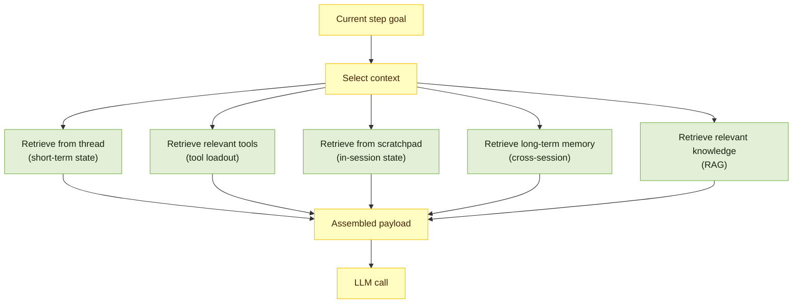
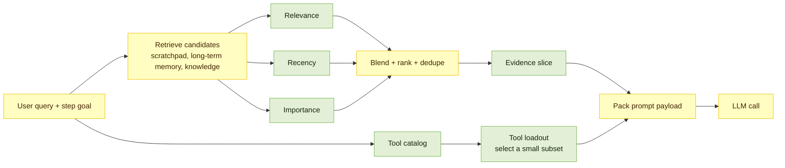
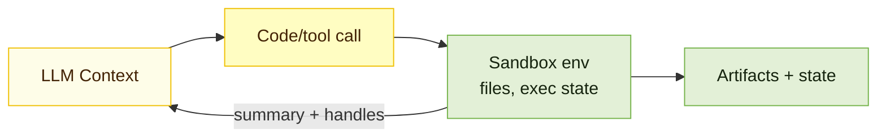
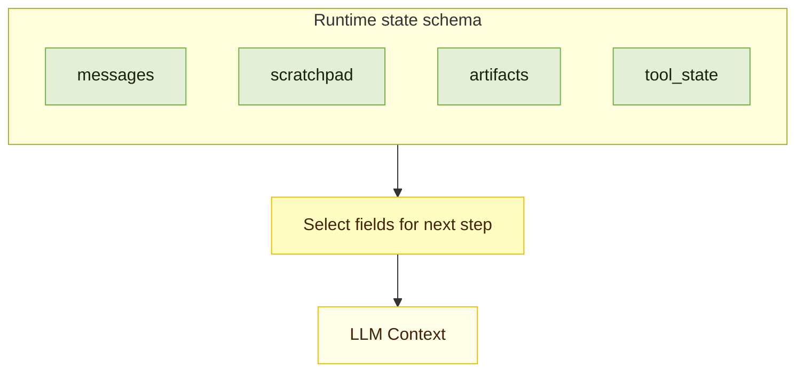

If you have ever demoed an agent that looked brilliant for five minutes and then fell apart on a real workflow, you have already met context engineering.

In the early days of LLMs, “prompt engineering” was the headline. It made sense: change a few words, get a different answer. But prompts are static. They describe one interaction.

Agents are not one interaction. They are a loop: plan, call tools, read outputs, update state, repeat. The hard part is not writing the recipe. It is preparing the ingredients, the tools, and the right evidence for the next step.

A useful analogy is mise en place for an agent. Before service starts, a great kitchen does not just have a recipe. It has chopped onions, labeled sauces, the right pan on the right station, and a clear understanding of the diner’s preferences. That prep work is what makes the meal consistent.

LLMs are inherently stateless. For a single API call, the context window is the model’s entire universe. Context engineering is the system that decides what goes into that universe, and just as importantly, what stays out.

## Why longer context windows do not magically solve the problem

Longer windows help, but they also tempt us into sloppy behavior: “Screw it, throw it all in.” The problem is that tokens are not free.

- **Cost and latency** grow with every extra token you send.
- **Noise** grows too: stale facts, conflicting instructions, and verbose tool logs.
- **Quality can degrade** as input gets longer, even when the task itself is simple.

Recent long-context evaluations are a useful reality check. Models can score near-perfect on Needle-in-a-Haystack style retrieval, then still degrade as you increase input length, especially when the needle and the question have lower semantic similarity and when distractors are present. In other words, the hard part is not only retrieval. It is filtering and reasoning in the presence of distractors.

In production, long contexts tend to fail in five recurring ways:

- **Context poisoning**: a mistake makes it into context and keeps getting reused.
- **Context distraction**: the model over-focuses on the prompt history and under-uses what it learned during training.
- **Context confusion**: irrelevant details crowd out signal and degrade reasoning.
- **Context clash**: new tools, facts, or instructions conflict with what is already there.
- **Context rot**: performance degrades as context grows, even when the task is unchanged, especially as distractors accumulate and the relevant evidence is less directly aligned with the query.

When an agent starts to drift, you can usually recover by doing one of four things: **write** important state somewhere durable, **select** only the evidence needed for the next step, **compress** what you keep so signal fits in the window, or **isolate** different kinds of context so they do not collide.

<div className="mx-auto grid max-w-5xl gap-6 md:grid-cols-2">
<div>
```mermaid
flowchart TB
  classDef primary fill:#fffdc2,stroke:#efc003,stroke-width:1px,color:#432305;
  classDef secondary fill:#e3f0d7,stroke:#75b34a,stroke-width:1px,color:#16240f;
  classDef ctx fill:#fefde8,stroke:#efc003,stroke-width:1px,color:#432305;

subgraph W["Write Context"]
direction TB
W_CTX["LLM Context"]:::ctx
W_LTM["Long-term memories<br/>(across sessions)"]:::secondary
W_SP["Scratchpad<br/>(within session)"]:::secondary
W_STATE["State<br/>(within session)"]:::secondary
W_CTX -->|write out| W_LTM
W_CTX -->|write out| W_SP
W_CTX -->|write out| W_STATE
end

````
</div>

<div>
```mermaid
%%{init: {"themeVariables": {"fontSize": "18px"}}}%%
flowchart TB
  classDef primary fill:#fffdc2,stroke:#efc003,stroke-width:1px,color:#432305;
  classDef secondary fill:#e3f0d7,stroke:#75b34a,stroke-width:1px,color:#16240f;
  classDef ctx fill:#fefde8,stroke:#efc003,stroke-width:1px,color:#432305;

  subgraph S["Select Context"]
    direction TB
    S_CTX["LLM Context"]:::ctx
    S_TOOLS["Relevant tools"]:::secondary
    S_SP["Scratchpad"]:::secondary
    S_LTM["Long-term memory"]:::secondary
    S_KNOW["Knowledge base"]:::secondary
    S_TOOLS -->|retrieve| S_CTX
    S_SP -->|retrieve| S_CTX
    S_LTM -->|retrieve| S_CTX
    S_KNOW -->|retrieve| S_CTX
  end
````

</div>

<div>
```mermaid
flowchart TB
  classDef primary fill:#fffdc2,stroke:#efc003,stroke-width:1px,color:#432305;
  classDef secondary fill:#e3f0d7,stroke:#75b34a,stroke-width:1px,color:#16240f;
  classDef ctx fill:#fefde8,stroke:#efc003,stroke-width:1px,color:#432305;

subgraph C["Compress Context"]
direction TB
C_RAW["Context (before)"]:::secondary
C_SUM["Summarize<br/>(retain relevant tokens)"]:::primary
C_TRIM["Trim<br/>(remove irrelevant tokens)"]:::primary
C_CTX["LLM Context (after)"]:::ctx
C_RAW --> C_SUM --> C_CTX
C_RAW --> C_TRIM --> C_CTX
end

````
</div>

<div>
```mermaid
flowchart TB
  classDef primary fill:#fffdc2,stroke:#efc003,stroke-width:1px,color:#432305;
  classDef secondary fill:#e3f0d7,stroke:#75b34a,stroke-width:1px,color:#16240f;
  classDef ctx fill:#fefde8,stroke:#efc003,stroke-width:1px,color:#432305;

  subgraph I["Isolate Context"]
    direction TB
    I_CTX["LLM Context"]:::ctx
    I_STATE["Partition in state<br/>(separate fields)"]:::secondary
    I_SBX["Hold in sandbox<br/>(artifacts, exec state)"]:::secondary
    I_MA["Partition across agents<br/>(separate windows)"]:::secondary
    I_OK["Lower clash risk<br/>cleaner prompts"]:::primary
    I_STATE --> I_OK
    I_SBX --> I_OK
    I_MA --> I_OK
    I_OK --> I_CTX
  end
````

</div>
</div>

<DiagramSubtitle>The four pillars of context engineering</DiagramSubtitle>

## Bucket 1: Write context (persist outside the prompt)

Writing context is about durability. The context window is working memory. If something needs to survive past the next model call, it has to live somewhere else.

In practice, most “write context” decisions fall into three places: **scratchpads** (in-session), **artifacts** (in-session, but too large or too raw for prompts), and **memory** (cross-session).

### Scratchpads (in-session)

Scratchpads are where agents take notes while they work. They are not user-facing, and they should not be treated as chat history. They are a place to keep:

- The current plan and progress
- Constraints and decisions that should not be re-litigated every turn
- Intermediate results and open questions
- Short summaries of tool outputs (especially when outputs are long)

Implementations vary, but the idea stays the same:

- Write to a file (good for handoffs and larger artifacts)
- Write to a runtime state object (easy to read and write in orchestration frameworks)
- Checkpoint that state so it survives tool calls and long runs

### Artifacts (in-session, but not in the prompt)

Artifacts are the bulky stuff: logs, long tool outputs, tables, intermediate files, screenshots, and anything you might want to reference later without paying the token cost every turn.

The key idea is separation. Keep large blobs out of the prompt, then pull back only what you need, when you need it. Think of artifacts as the agent’s backpack, not its working memory.

Common artifact shapes:

- **Raw tool outputs**: API responses, HTML pages, search results, database dumps
- **Derived work products**: tables, ranked lists, extracted quotes, cleaned datasets
- **Execution traces**: command logs, stack traces, network errors, retry histories
- **Intermediate files**: drafts, diffs, generated code, notebooks, charts

Two practical patterns make artifacts usable:

- **Store a pointer plus metadata**: a short title, where it came from, and why it matters. The prompt should see the pointer and summary, not the whole blob.
- **Summarize at write time, slice at read time**: write a small summary next to the artifact, then retrieve targeted snippets later (for example, “the one paragraph that mentions rate limits”).

### Memory (cross-session)

Memory is what should follow the user or project across sessions: preferences, stable facts, recurring context. Keep it curated. You do not want to “remember the transcript,” you want a small set of items that reliably changes what the agent does next time.

It helps to separate memory by recall scope:

- **Short-term memory (thread-scoped)** tracks an ongoing conversation. In many agent frameworks, this lives in the agent’s state and is persisted via checkpoints so you can resume the thread. This is where scratchpads, retrieved documents, and “what we have done so far” usually live.
- **Long-term memory (cross-session)** stores user or app level information across threads. It can be recalled in any future session, if it is relevant enough to earn its way into the prompt.

Long-term memory also comes in different flavors. A simple mapping that tends to be practical:

| Memory type    | What it stores         | Agent example                                                |
| -------------- | ---------------------- | ------------------------------------------------------------ |
| **Semantic**   | Facts and preferences  | “User prefers short answers”, “Project uses Next.js”         |
| **Episodic**   | Past experiences       | A successful previous run, turned into a reusable example    |
| **Procedural** | Rules and instructions | The agent’s operating guidelines, or a refined system prompt |

This becomes non-negotiable in long-horizon work. When you are approaching context limits, summarize completed phases and persist the current plan externally. That is how you can spin up a fresh subagent with a clean context, then continue without losing the thread. Durable execution builds on the same instinct: persist enough state that you can resume instead of restarting.

#### Hot path vs background writes

Once you decide something should become long-term memory, you still have to choose when that write happens. A practical split is to write “in the hot path” (during the user-facing loop) or write “in the background” (as an asynchronous job).

In the hot path, memory creation is part of the agent’s main flow. Practically, this usually means an extra write step (often a tool call that upserts to a memory store) before the agent returns its final answer. This makes new memories immediately available and can be transparent (you can tell the user what was saved), but it adds latency and forces the agent to multitask: solve the task and decide what is worth remembering.

In the background, memory creation is decoupled from the main flow. This keeps the user-facing loop fast and separates application logic from memory management, but it introduces its own operational questions: how often to write, what triggers a write, and how to avoid redundant or stale memories.

| Write mode | When it runs          | Upside                                        | Cost                              |
| ---------- | --------------------- | --------------------------------------------- | --------------------------------- |
| Hot path   | During the step loop  | Immediate recall, easier to explain to users  | More latency, more cognitive load |
| Background | Outside the step loop | Lower latency, cleaner separation of concerns | Needs triggers, can lag behind    |

<div className="mx-auto grid max-w-5xl gap-6 md:grid-cols-2">
<div>
```mermaid
flowchart TB
  classDef primary fill:#fffdc2,stroke:#efc003,stroke-width:1px,color:#432305;
  classDef secondary fill:#e3f0d7,stroke:#75b34a,stroke-width:1px,color:#16240f;

subgraph HOT["In the hot path (sync)"]
direction TB
H1["User message"]:::primary --> H2["Update memory<br/>(tool call)"]:::secondary --> H3["Respond to user"]:::primary
H3 -. repeat per message .-> H1
end

````
</div>

<div>
```mermaid
flowchart TB
  classDef primary fill:#fffdc2,stroke:#efc003,stroke-width:1px,color:#432305;
  classDef secondary fill:#e3f0d7,stroke:#75b34a,stroke-width:1px,color:#16240f;

  subgraph BG["In the background (async)"]
    direction TB
    B1["User message"]:::primary --> B2["Respond to user"]:::primary
    B2 -. repeat per message .-> B1
    B2 --> B3["Memory write scheduled<br/>(timer, cron, event)"]:::secondary --> B4["Update memory"]:::secondary
  end
````

</div>
</div>

<DiagramSubtitle>Synchronous vs. asynchronous memory writes</DiagramSubtitle>

#### The write decision

After each agent step, make the persistence decision explicit. Most context bloat comes from skipping this and letting everything leak into the next prompt by default.

```mermaid
flowchart TD
  classDef primary fill:#fffdc2,stroke:#efc003,stroke-width:1px,color:#432305;
  classDef secondary fill:#e3f0d7,stroke:#75b34a,stroke-width:1px,color:#16240f;

  A["Agent step completes"]:::primary --> D{"Does this need to persist?"}:::primary

  D -->|Yes, within session| SP["Write to scratchpad / state"]:::secondary
  D -->|Yes, across sessions| MEM["Write to long-term memory"]:::secondary
  D -->|Yes, large artifact| ART["Write to artifact store<br/>files, DB, reports"]:::secondary
  D -->|No| DROP["Drop"]:::secondary

  SP -->|read later| A
  MEM -->|retrieve later| A
  ART -->|reference later| A
```

<DiagramSubtitle>The persistence decision flow</DiagramSubtitle>

## Bucket 2: Select context (retrieve only what matters now)

Selection is relevance under a budget. For each model call, aim to include:

1. **Task frame**: goal, constraints, what “done” means for this step.
2. **Evidence**: the minimum facts needed to decide the next action.
3. **Action space**: only the tools relevant right now.

In practice, “selecting context” is not one retrieval. It is a small set of targeted retrieval passes, each pulling from a different store:

- Conversation state (thread history, pinned items, rolling summary)
- Relevant tools (what the agent is allowed to do right now)
- Scratchpad (what the agent already discovered in this run)
- Long-term memory (what the agent should remember across runs)
- Relevant knowledge (what the agent should reference from docs, data, or the web)

### Conversation state (short-term, thread-scoped)

A thread defines the conversation boundary, but it should not dictate prompt size. Store the full history in the thread so you can resume and audit, then inject only a curated slice into the next call.

A simple default is:

- Recent turns (last N messages)
- Pinned items (current goal, constraints, decisions)
- A rolling summary of older context



<DiagramSubtitle>Context selection from multiple sources</DiagramSubtitle>

### Retrieve relevant tools

Tools are part of context too. A tool definition is not just an API schema, it is also an affordance. If you show the model too many tools at once, it can spend attention sorting them out instead of doing the task. In one reported evaluation (prompting DeepSeek-v3), tool overlap became a problem above 30 tools, and beyond 100 tools the model was virtually guaranteed to fail the tool selection test without dynamic tool selection. At scale, token burn is just as bad: large tool catalogs can consume tens of thousands of tokens before the agent even reads the user request.

The practical technique is a tool loadout:

- Maintain a catalog of tools with short, crisp descriptions.
- Retrieve only the small subset of tools relevant to the current step.
- Hide the rest, not because they are “bad”, but because they are not earning their keep right now.

Two upgrades make loadouts work at scale:

- **Tool search**: keep only a search capability + a few always-on tools in context, and defer the rest. The agent discovers and loads 3–5 matching tools on-demand instead of carrying 50+ definitions upfront.
- **Programmatic tool calling**: when a step involves many calls or large intermediate results, orchestrate tools in code so only the final output enters the model’s context.

Here is what tool search looks like in practice: a small, always-available search tool narrows the catalog before the model sees any full tool schemas.

<Image
  alt="Tool search narrows the catalog before loading full tool schemas"
  src="/static/images/blogs/context-engineering-for-ai-agents/anthropic_tool-search.png"
  width={900}
  height={520}
  className="mx-auto"
/>

<DiagramSubtitle>Tool search narrows the catalog before loading full tool schemas</DiagramSubtitle>

Accuracy still depends on how tools are described. Schemas say what’s valid, but not what’s correct. Add short, representative tool use examples to teach parameter conventions and disambiguate similar tools.

### Retrieve relevant skills

Skills are modular, filesystem-based bundles of instructions, scripts, and reference material. Like tools, they are part of context selection: load only the skills that help with the current step, and keep the rest out of the prompt. Skill selection is a retrieval step in its own right: query the skill catalog by metadata (name + description), rank by task fit, and load only the smallest set that covers the current goal.

Selection heuristics that keep skill loadouts tight:

- Trigger on strong signals: explicit user mention, file type (PDF, PPTX), or a domain task the skill is built for.
- Prefer the narrowest skill that fully covers the task; avoid broad "do-everything" skills when a specific one exists.
- Cap the loadout (often 1 primary + 0-1 supporting skills) to prevent conflicting instructions.
- Defer loading if unsure; you can always pull a skill mid-run when the need becomes clear.

Skills support progressive disclosure:

- Level 1: metadata (name + description) is always available for discovery.
- Level 2: the `SKILL.md` instructions load only when a skill is triggered.
- Level 3+: additional resources or scripts load only when referenced.

This keeps the context window small: the agent only reads the skill file it needs, then follows references on demand instead of preloading an entire toolkit.

<Image
  alt="Skills are pulled into context only when triggered by the task"
  src="/static/images/blogs/context-engineering-for-ai-agents/anthropic_skills.png"
  width={900}
  height={520}
  className="mx-auto"
/>

<DiagramSubtitle>Skills enter the context window only when triggered</DiagramSubtitle>

Once a skill is loaded, treat its instructions like a mini playbook: follow the workflow it defines, and only open deeper resources (guides, templates, scripts) when the current step requires them. This keeps the prompt lean while still letting you tap into richer, domain-specific guidance on demand.

Here is a sample skill as it appears in practice:

<Image
  alt="Sample skill layout with SKILL.md and referenced files"
  src="/static/images/blogs/context-engineering-for-ai-agents/anthropic_sample_skill.png"
  width={900}
  height={520}
  className="mx-auto"
/>

<DiagramSubtitle>Example skill structure</DiagramSubtitle>

For concrete examples, see Anthropic's open-source agent skills repository: https://github.com/anthropics/skills.

### Retrieve from scratchpad

Scratchpad retrieval is the easiest win because it is already “yours”. It is the agent’s own intermediate state: constraints, partial results, open questions, and notes from prior tool calls.

Two patterns make scratchpads usable:

- Keep scratchpad as structured buckets (constraints, plan, intermediate facts), not an unbounded wall of text.
- Prefer “pinned” items over recency alone, for example: the current goal, non-negotiable constraints, and latest decisions.

### Retrieve long-term memory

Long-term memory is what you want to carry across sessions, without dragging along the full transcript. The technique is not “retrieve everything”. It is “retrieve the right memories, under a budget”.

In practice, long-term memory is usually a mix of:

- Stable preferences (style, tone, defaults)
- Stable facts (profile, environment, recurring projects)
- Commitments (what was agreed on, what “done” means)

The retrieval trick is to blend relevance, recency, and importance, so a core preference can survive time decay, while stale trivia quietly disappears.

How you load long-term memory matters as much as what you store. Some systems inject a curated memory block before the first model call, others retrieve memories on demand in the middle of a run.

“Memory” can be retrieved either by the model or for the model.

- In “memory as a tool”, long-term memory lives in a store and is fetched via an explicit read (the agent decides when to call it).
- In “memory as preflight”, long-term memory lives in configuration or rule files that are automatically loaded into the session context by the client before the first model call. The retrieval still happens, it is just proactive and outside the model’s action loop. This is how Claude Code does it: it loads project and user memory files automatically at startup (for example `CLAUDE.md`), then uses them as baseline context.

If you want the preflight ergonomics in your own agent, treat “load memory” as a step that runs before the first model call (and occasionally re-runs when scope changes), then inject the curated result into system instructions under a strict token budget.

| Pattern                           | Who triggers recall | Latency         | Best for                          |
| --------------------------------- | ------------------- | --------------- | --------------------------------- |
| Proactive injection (client-side) | Runtime or client   | Lowest per step | Stable preferences, project rules |
| Reactive tool call (agent-side)   | The model           | Adds a tool hop | Episodic recall, sparse memory    |

In practice, proactive injection is just “prepend a curated memory block to system instructions”. Memory as a tool is “when you need a memory, query the store, then inject the result for this step”.

### Retrieve relevant knowledge

Relevant knowledge is the external “evidence” the agent should ground itself in: docs, tickets, runbooks, codebases, or web pages. The technique is retrieval plus packaging:

- Retrieve a small number of high-signal chunks, not entire documents.
- Prefer hybrid retrieval (semantic + lexical) when your domain has exact identifiers (error codes, function names, IDs).
- Rerank and dedupe aggressively, then present results as a short evidence bundle.

A common mistake is “embedding-only retrieval.” Semantic similarity is necessary, but it is not sufficient. In practice, retrieval works best when you blend at least three signals:

- **Relevance** (semantic similarity)
- **Recency** (time decay)
- **Importance** (assigned at write-time, often via consolidation)

Start simple with a blended score (a weighted mix of relevance, recency, importance), then tune the weights based on the failures you see.



<DiagramSubtitle>Hybrid retrieval scoring</DiagramSubtitle>

### Where you inject retrieved context matters

Four placement choices come up often:

- **System instructions**: highest authority, good for stable profile facts and non-negotiable constraints.
- **Conversation history**: easy, but risks “dialogue injection” where retrieved facts are mistaken for something the user said.
- **Memory-as-a-tool**: efficient for episodic recall, but adds a sequential tool-call step.
- **Skill instructions**: load a relevant skill on demand, then follow its playbook for the current step.

<div className="mx-auto max-w-2xl">
```mermaid
flowchart TD
  classDef primary fill:#fffdc2,stroke:#efc003,stroke-width:1px,color:#432305;
  classDef secondary fill:#e3f0d7,stroke:#75b34a,stroke-width:1px,color:#16240f;

START["Need extra context for this step?"]:::primary --> CHOICE{Strategy}:::primary
CHOICE -->|proactive| SYS["Inject into<br/>system instructions"]:::secondary
CHOICE -->|inline| HIST["Insert into<br/>conversation history"]:::secondary
CHOICE -->|reactive| TOOL["Call memory tool<br/>then inject result"]:::secondary
CHOICE -->|skills| SKILL["Load skill instructions<br/>on demand"]:::secondary

SYS --> PAY["Assembled payload"]:::primary
HIST --> PAY
TOOL --> PAY
SKILL --> PAY
PAY --> LLM["LLM call"]:::primary

````

<DiagramSubtitle>Context injection strategies</DiagramSubtitle>
</div>

Many production systems use a hybrid: stable facts in system instructions, episodic memories retrieved on demand.

## Bucket 3: Compress context (fight token bloat and context rot)

Compression is what you do when the running session becomes a liability: too expensive, too slow, or too noisy.

There are three common moves, ordered from safest to riskiest:

- **Pruning**: keep recent detail, drop older nuance (good for chatty sessions).
- **Offloading**: keep full fidelity outside the prompt (good for logs, tables, long docs).
- **Summarization**: keep decisions and state, lose exact wording (good for long trajectories and handoffs).

Two design details matter more than the choice itself.

### Summaries should be state, not prose

A nice paragraph summary is great for humans, and often useless for agents. Agents need state: decisions, constraints, open questions, next steps.

If you want a summary that actually supports the next step, define the fields it must preserve:

- Goal (what the user is trying to achieve)
- Constraints (hard rules, policies, preferences)
- Decisions (what was decided and why, at a high level)
- Open questions (what is still missing)
- Artifacts (pointers to raw data stored outside the prompt)
- Next steps (what the agent should do next)

<div className="mx-auto max-w-2xl">
```mermaid
flowchart TD
  classDef primary fill:#fffdc2,stroke:#efc003,stroke-width:1px,color:#432305;
  classDef secondary fill:#e3f0d7,stroke:#75b34a,stroke-width:1px,color:#16240f;

HIST["Long session history"]:::secondary --> TRIG{Compaction trigger}:::primary
TRIG -->|count-based| COMP["Compaction job"]:::secondary
TRIG -->|time-based| COMP
TRIG -->|event-based| COMP

COMP --> CHOICE{Compression move}:::primary
CHOICE -->|prune| PRUNE["Keep recent turns"]:::secondary
CHOICE -->|offload| OFF["Store raw as artifacts"]:::secondary
CHOICE -->|summarize| SUM["State summary<br/>goal, constraints, decisions,<br/>open questions, next steps"]:::secondary

PRUNE --> NEXT["Next prompt payload"]:::primary
OFF --> NEXT
SUM --> NEXT

````

<DiagramSubtitle>Context compaction lifecycle</DiagramSubtitle>
</div>

### Compaction triggers should be explicit

Three trigger types come up often:

- **Count-based**: when token usage reaches a threshold (reliable, blunt).
- **Time-based**: compress during inactivity (good for chat workloads).
- **Event-based**: compress at semantic boundaries (harder, cleanest output).

If you do not define triggers, compaction turns into an emergency response, not a system.

## Bucket 4: Isolate context (prevent collisions and enable parallelism)

Isolation is how you prevent context clash. It shows up at three levels.

```mermaid
flowchart LR
  classDef primary fill:#fffdc2,stroke:#efc003,stroke-width:1px,color:#432305;
  classDef secondary fill:#e3f0d7,stroke:#75b34a,stroke-width:1px,color:#16240f;

  U[User]:::primary --> S1["Session A"]:::secondary
  U --> S2["Session B"]:::secondary

  S1 --> ACL["ACL boundary<br/>user isolation"]:::primary
  S2 --> ACL

  subgraph BUCKETS["Structured buckets (within a session)"]
    HISTB["History"]:::secondary
    TOOLB["Tool outputs"]:::secondary
    SPB["Scratchpad"]:::secondary
    MEMB["Retrieved memories"]:::secondary
  end

  ACL --> BUCKETS --> PAY["Assembled payload"]:::primary

  PAY --> ORCH["Lead agent"]:::primary
  ORCH -->|delegate read| A1["Subagent 1"]:::secondary
  ORCH -->|delegate read| A2["Subagent 2"]:::secondary
  A1 -->|summary + pointers| ORCH
  A2 -->|summary + pointers| ORCH

  ORCH --> SBX["Execution sandbox"]:::secondary
  SBX --> ART["Artifacts"]:::secondary
  ART --> PAY
```

<DiagramSubtitle>Isolation boundaries across sessions and agents</DiagramSubtitle>

### 1) Multi-agent isolation (read in parallel, write with caution)

Multi-agent setups can work well for breadth-first “reading” tasks. Subagents explore in parallel, then send condensed results back to a lead agent. It is functional compression.

The counterweight is that parallel “writing” is fragile. Actions carry implicit decisions. Two subagents can make conflicting choices (dependencies, function names, architecture) and the merge becomes a context clash problem disguised as coordination.

- Use parallel agents to read, search, and summarize.
- Use a single agent to synthesize the final artifact.

<Image
  alt="Parallel read and single write pattern for multi-agent synthesis"
  src="/static/images/blogs/context-engineering-for-ai-agents/anthropic-multi-agent-system.png"
  width={900}
  height={520}
  className="mx-auto"
/>

<DiagramSubtitle>Parallel read and single write pattern for multi-agent synthesis</DiagramSubtitle>

### 2) Environment isolation (sandboxes keep heavy state out of the prompt)

Sandboxed execution is a clean way to prevent tool output from flooding the prompt. Instead of returning every intermediate artifact to the model, run code in a contained environment and pass back only the parts that matter right now. This is especially useful for token-heavy objects like documents, code and logs.

Practical sandbox patterns:

- **Return handles, not blobs**: store artifacts in the sandbox, return a short handle + summary to the LLM.
- **Promote selectively**: only lift small snippets into the prompt when the next step needs them.
- **Reset aggressively**: treat the sandbox as disposable so stale state does not leak across tasks.

The key benefit is isolation: execution state is real and durable, but the prompt only sees a curated view.



<DiagramSubtitle>Sandboxed execution isolates heavy state from the prompt</DiagramSubtitle>

### 3) State isolation (separate fields, selective exposure)

Runtime state is a second isolation layer. Instead of one unstructured message list, define a schema with explicit fields and only expose the fields needed for a given step. That lets you keep high-value facts close while quarantining anything noisy, risky, or too large.

Examples of state buckets that reduce clashes:

- **messages**: the minimal conversational slice needed for the next turn.
- **scratchpad**: decisions, constraints, and plan checkpoints.
- **artifacts**: pointers to large outputs (files, tables, logs).
- **tool_state**: raw tool outputs and execution metadata.

This makes isolation a default: most data stays in state, and only a thin, intentional slice reaches the LLM on each call.



<DiagramSubtitle>State schema isolates context until it is explicitly selected</DiagramSubtitle>

## Conclusion

Prompt engineering writes the recipe. Context engineering does mise en place: it decides, turn by turn, what the model sees, what it does not see, and what gets persisted for later. Longer context windows help, but they do not remove the need for this discipline. They just give you a bigger junk drawer.

Most production techniques in this post reduce to four moves:

- **Write** what must outlive the next call (session state, scratchpad, curated memories, artifacts).
- **Select** the minimum evidence and the right tool loadout for the current step, not the entire transcript.
- **Compress** early and intentionally (prune, summarize, offload), with explicit compaction triggers so you do not only compress in a panic.
- **Isolate** to prevent collisions (parallel agents for reading and a single agent for synthesis).

If you build agents for real workflows, treat context as a first-class product. Budget tokens the way you budget latency, decide what becomes durable, and design for the failure modes (poisoning, distraction, confusion, clash) instead of discovering them in production. The question to keep asking is simple: is every token in this context earning its keep?

## References

1. [LangChain: Context engineering](https://docs.langchain.com/oss/python/langchain/context-engineering)
2. [Anthropic: Effective context engineering for AI agents](https://www.anthropic.com/engineering/effective-context-engineering-for-ai-agents)
3. [Context Engineering for AI Agents: Lessons from Building Manus](https://manus.im/blog/Context-Engineering-for-AI-Agents-Lessons-from-Building-Manus)
4. [LangChain Blog: Context engineering for agents](https://blog.langchain.com/context-engineering-for-agents/)
5. [Context Rot: How Increasing Input Tokens Impacts LLM Performance](https://research.trychroma.com/context-rot)
6. [How to Fix Your Context](https://www.dbreunig.com/2025/06/26/how-to-fix-your-context.html)
7. [LangChain: Memory overview](https://docs.langchain.com/oss/python/concepts/memory)
8. [Manage Claude's memory](https://code.claude.com/docs/en/memory)
9. [Don't Build Multi-Agents](https://cognition.ai/blog/dont-build-multi-agents)
10. [Advance Tool Use in Claude](https://www.anthropic.com/engineering/advanced-tool-use)
11. [Agent Skills](https://agentskills.io/home)

## Image Attribution

[Pergola with Oranges (c. 1834) - Thomas Fearnley, Norwegian, 1802-1842](https://www.artic.edu/artworks/160229/pergola-with-oranges)
