What happens when a developer's weekend project goes viral? You get a 100,000-star GitHub repository, a trademark dispute with Anthropic, two rebrands, and a vibrant community calling themselves the "Claw Crew."

This is the story of OpenClaw, an open-source AI agent platform that runs locally on your machine and works from the chat apps you already use.

> [!TIP] > **Your assistant. Your machine. Your rules.** That's the OpenClaw philosophy: run AI agents on your own infrastructure, connected to your own chat accounts.

## From Weekend Hack to 100,000 Stars

In November 2025, software engineer Peter Steinberger released what he called "Clawdbot," a tool to connect AI assistants to messaging apps. Two months later, that project had become one of the fastest-growing GitHub repositories of all time, surpassing 100,000 stars.

The naming journey alone tells you something about the project's wild ride:

1. **Clawdbot**: A playful pun on "Claude" with a claw. The project gained rapid traction until Anthropic's legal team politely asked them to reconsider the similarity to their Claude-branded products.
2. **Moltbot**: Born from a community Discord brainstorm. Molting represents growth, as lobsters shed their shells to become something bigger. Meaningful, but [it never quite rolled off the tongue](https://x.com/NetworkChuck/status/2016254397496414317).
3. **OpenClaw**: The final form. Trademark searches came back clear, domains purchased, migration code written. The name captures everything: _Open_ source, community-driven. _Claw_ as a nod to the lobster heritage.

The lobster mascot survived every rebrand. Some things are sacred. 🦞

## What is OpenClaw?

OpenClaw is an open-source autonomous AI personal assistant software that runs locally on user devices and integrates with messaging platforms. Unlike SaaS assistants where your data lives on someone else's servers, OpenClaw runs where you choose: laptop, homelab, or VPS.

The software operates as an autonomous agent that can execute tasks through messaging platforms such as WhatsApp, Telegram, and Signal, enabling automated workflows across multiple services.

At its core, OpenClaw:

- Runs on **your machine** (your infrastructure, your keys, your data)
- Works from **chat apps you already use**
- Integrates with **external AI models and APIs** to perform tasks autonomously
- Stores configuration data and interaction history **locally**

## Architecture

OpenClaw is built around a **Gateway-centric architecture** where a single long-running process manages all channel connections and provides a unified control plane. This design ensures reliability, security, and simplicity.

### The Gateway

The Gateway (`openclaw gateway`) is the heart of OpenClaw. It's a single process that manages all channel connections (WhatsApp, Telegram, Discord, etc.), provides a WebSocket control plane on port 18789, handles session management and routing, serves the Control UI/Dashboard, and coordinates agent communication.

**Key Principle:** One Gateway per host is recommended. It's the only process allowed to own the WhatsApp Web session, ensuring stability and preventing conflicts.

```mermaid
flowchart TB
  CH["WhatsApp / Telegram / Discord / iMessage\n(+ plugins)"] --> GW

  subgraph GW["Gateway (single source)"]
    WS["WebSocket control plane\nws://127.0.0.1:18789\n(loopback-only)"]
    CAN["Canvas host\nhttp://&lt;gateway-host&gt;:18793\n/__openclaw__/canvas/"]
  end

  GW --> PI["Pi agent (RPC)"]
  GW --> CLI["CLI (openclaw …)"]
  GW --> CHATUI["Chat UI (SwiftUI)"]
  GW --> MAC["macOS app (OpenClaw.app)"]
  GW --> IOS["iOS node\nvia Gateway WS + pairing"]
  GW --> AND["Android node\nvia Gateway WS + pairing"]
```



### Network Model

OpenClaw uses a **loopback-first** approach for security. By default, the Gateway WebSocket runs on `ws://127.0.0.1:18789` (localhost only). For remote access, use SSH tunnels, Tailscale, or configure `--bind tailnet` with authentication tokens. The Canvas Host HTTP file server runs on port 18793, serving `/__openclaw__/canvas/` for node WebViews.

### Agent Loop

The agent loop is the core processing cycle:

1. **Message Received**: Channel receives a message
2. **Session Routing**: Message is routed to appropriate session (main, group, or isolated)
3. **Context Loading**: Agent loads relevant context, memories, and tools
4. **LLM Processing**: Request sent to LLM provider (Claude, GPT, etc.)
5. **Tool Execution**: Agent executes tools as needed (browser, file system, etc.)
6. **Response Streaming**: Response streamed back to channel
7. **Memory Update**: Conversation and context saved to workspace


### Session Model

OpenClaw supports multiple session types: **Main Sessions** where direct messages collapse into a shared `main` session by default, **Group Sessions** where each group chat gets an isolated session, and **Isolated Sessions** that can be created for specific routing or security needs.

Session features include activation modes (control when the agent responds), queue modes (handle concurrent requests), session isolation (groups can run in Docker sandboxes), and automatic context management with loading and pruning.

### Workspace Structure

OpenClaw stores everything as files and folders in your workspace (`~/clawd` by default):

- **Configuration**: `~/.clawdbot/moltbot.json`
- **Credentials**: `~/.clawdbot/credentials/`
- **Workspace Root**: `~/clawd/`
- **Prompt Files**: `AGENTS.md`, `SOUL.md`, `TOOLS.md`
- **Skills**: `~/clawd/skills/<skill>/SKILL.md`
- **Memory Files**: Daily notes in Markdown format
- **Sessions**: Session state and history

This file-based approach means you can edit configurations directly, search memories with tools like Raycast or Obsidian, version control your workspace, and backup everything easily

## Supported Channels

OpenClaw supports messaging platforms where your conversations already happen:

**Built-in channels:**

- WhatsApp
- Telegram
- Discord
- Signal
- Slack
- Microsoft Teams
- Twitch
- Google Chat

Setting up a channel uses a simple login flow:

```bash
# Pair with WhatsApp (displays QR code)
openclaw channels login
```

Then configure who can talk to your agent. Here's an example from the documentation:

```json
{
  "channels": {
    "whatsapp": {
      "allowFrom": ["+15555550123"],
      "groups": { "*": { "requireMention": true } }
    }
  },
  "messages": { "groupChat": { "mentionPatterns": ["@openclaw"] } }
}
```

This restricts inbound messages to specific phone numbers and ensures the agent only responds when explicitly mentioned in group chats.

[Full Channel Documentation](https://docs.openclaw.ai/channels)

## Model Support

OpenClaw integrates with external AI models through a flexible provider system. You're not locked into a single vendor:

- **Anthropic** (Claude Sonnet, Claude Opus)
- **OpenAI** (GPT models)
- **Google** (Gemini models)
- **Ollama** (self-hosted local models)
- **LM Studio** (local inference)

OpenClaw is not limited to these options. Through its flexible provider system, it supports any OpenAI-compatible API, allowing you to connect with virtually any modern LLM, including custom fine-tunes and specialized models.

Configure your preferred model and fallbacks:

```json
{
  "agents": {
    "defaults": {
      "model": {
        "primary": "anthropic/claude-sonnet-4-5",
        "fallbacks": ["anthropic/claude-opus-4-5", "openai/gpt-4o"]
      }
    }
  }
}
```

Configuration and interaction history are stored locally, enabling persistent behavior across sessions.

## Multi-Agent Configuration

OpenClaw supports running multiple specialized agents. Here's an example from the documentation showing agent definitions:

```json
{
  "agents": {
    "list": [
      {
        "id": "code-reviewer",
        "name": "Code Reviewer",
        "workspace": "/path/to/code-reviewer",
        "sandbox": { "mode": "all" }
      },
      {
        "id": "security-auditor",
        "name": "Security Auditor",
        "workspace": "/path/to/security-auditor",
        "sandbox": { "mode": "all" }
      }
    ]
  },
  "broadcast": {
    "120363403215116621@g.us": ["code-reviewer", "security-auditor"],
    "+15555550123": ["assistant", "logger"]
  }
}
```

[Agent Configuration Guide](https://docs.openclaw.ai/agents)

## Security Considerations

OpenClaw has drawn scrutiny from cybersecurity researchers due to the broad permissions it requires to function effectively. Because the software can access email accounts, calendars, messaging platforms, and other sensitive services, misconfigured or exposed instances present security and privacy risks.

Articles published by technology outlets have identified potential vulnerabilities such as:

- **Prompt injection** (an industry-wide unsolved problem)
- Exposed administrative interfaces
- Storage of credentials in local configuration files

OpenClaw relies on the Model Context Protocol (MCP) to interface with over 100 third-party services. Security researchers have warned that the extensible nature of the architecture introduces supply chain risks, as compromised or poorly audited modules could enable privilege escalation.

> [!CAUTION]
> OpenClaw is primarily suited for advanced users who understand the security implications of running autonomous agents. The project recommends studying their [security best practices](https://docs.openclaw.ai/gateway/security).

### Community Hardening

The open-source community is actively collaborating to identify and patch these vulnerabilities. Recent efforts focus on hardening the codebase, improving isolation mechanisms, and validating security properties. The team has also released [machine-checkable security models](https://github.com/vignesh07/clawdbot-formal-models) to help verify system correctness.

## Getting Started

The fastest path to installation:

```bash
curl -fsSL https://openclaw.ai/install.sh | bash
```

For Docker deployment, the documentation recommends:

```bash
./docker-setup.sh
```

[Official Installation Guide](https://docs.openclaw.ai/install)

## The Ecosystem

OpenClaw has spawned complementary projects:

- **[ClawdHub](https://clawhub.ai/)**: A marketplace for bot capabilities where developers share and distribute skill modules. Think of it as an "App Store" for your agent, allowing you to easily add new capabilities like calendar management, web search, or specialized integrations.
- **[Moltbook](https://www.moltbook.com/)**: An AI agent-exclusive social network where autonomous agents interact with each other (humans can only observe)
- **[Claw Crew Discord](https://discord.gg/openclaw)**: The community of contributors and users

## What's Next?

From Peter's announcement:

> Security remains our top priority. We're also focused on gateway reliability and adding polish plus support for more models and providers.
>
> This project has grown far beyond what I could maintain alone. I'm figuring out how to pay maintainers properly, full-time if possible.

The lobster has molted into its final form. It's open source, community-driven, and still wearing the same shell at its core.

## Getting Involved

- 🌐 **Website**: [openclaw.ai](https://openclaw.ai/)
- 📚 **Docs**: [docs.openclaw.ai](https://docs.openclaw.ai)
- 🐙 **GitHub**: [github.com/openclaw/openclaw](https://github.com/openclaw/openclaw)
- 💬 **Discord**: [discord.gg/openclaw](https://discord.gg/openclaw)
- 💖 **Sponsor**: [github.com/sponsors/openclaw](https://github.com/sponsors/openclaw)

Just watch out for the claws. 🦞

## References

1. [OpenClaw Official Site](https://openclaw.ai/)
2. [Introducing OpenClaw (Peter Steinberger)](https://openclaw.ai/blog/introducing-openclaw)
3. [OpenClaw Documentation](https://docs.openclaw.ai)
4. [OpenClaw on Wikipedia](https://en.wikipedia.org/wiki/OpenClaw)
5. [Wired: "Clawdbot Is Taking Over Silicon Valley"](https://www.wired.com/story/clawdbot-moltbot-viral-ai-assistant/)
6. [Axios: "Moltbot highlights cybersecurity risks of autonomous AI agents"](https://www.axios.com/2026/01/29/moltbot-cybersecurity-ai-agent-risks)
7. [Security Best Practices](https://docs.openclaw.ai/gateway/security)
