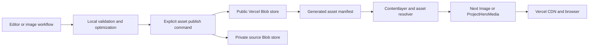

# Ylang Labs Codebase Audit — 2026-07-13

## Executive decision

Use Vercel Blob for published blog and project media, but do not copy the current asset tree unchanged.

The current 307.90 MiB corpus fits inside the Vercel Hobby plan's 1 GB-month Blob allowance. The binding constraint is the 10 GB monthly Blob data-transfer allowance: six animated GIFs alone total 75.75 MiB. Storage migration must therefore begin with media cleanup and GIF-to-video conversion.

Keep small boot-critical assets such as favicons and compact logos in `public/`. Store optimized public derivatives in a public Blob store and reusable source artwork in a separate private Blob store. Preserve logical asset identities through a checked-in manifest and a single resolver so content is not permanently coupled to Vercel URLs.

The audit also found two problems that should be fixed before or alongside the Blob migration:

1. The production dependency graph reports 98 advisories, including direct Next.js and Mermaid vulnerabilities with patched releases available.
2. Every blog article currently ships all post-specific client diagrams and charts, even when a page uses none of them.

## Scope and evidence

Four parallel lanes inspected asset history and delivery, Next.js and content architecture, UI/accessibility, and validation. The audit used the current `main` source after a concurrent update moved the checkout from the original blog branch and updated `origin/main` to `69643ef`.

Evidence collected:

- Full source/config/route/component inspection.
- Current and historical Git blob inventory.
- Image count, byte, format, duplicate, and reference scans.
- Fresh Next.js 16.1.1 documentation through Context7.
- Current Vercel Blob pricing, caching, public-storage, and CLI documentation.
- Fresh Vercel Web Interface Guidelines.
- Production dependency audit from `pnpm audit --prod --audit-level moderate`.
- Direct package-registry checks for affected packages.
- Unit, lint, production-build, and standalone-TypeScript validation.
- Live response-header inspection for a 21.34 MiB project GIF on `ylanglabs.com`.

## Priority map

| Priority | Finding                                                 | Impact                                  | Effort      |
| -------- | ------------------------------------------------------- | --------------------------------------- | ----------- |
| P0       | Upgrade vulnerable direct dependencies                  | Security and availability               | Medium      |
| P0       | Convert large GIFs and establish media budgets          | Page weight and Blob free-tier safety   | Medium      |
| P0       | Split the global MDX component registry                 | Article JavaScript and interaction cost | Medium      |
| P1       | Add a complete type-check gate                          | Correctness and CI confidence           | Low         |
| P1       | Migrate publishable media to Vercel Blob                | Git, CI, deploy, and asset lifecycle    | Medium-high |
| P1       | Repair systemic contrast and reduced-motion failures    | Accessibility and design compliance     | Low-medium  |
| P1       | Move contact submission server-side and harden CSP      | Abuse and browser security              | Medium      |
| P2       | Remove unused build constraints and dead/template code  | Build speed and maintenance             | Low-medium  |
| P2       | Repair RSS/sitemap correctness and generated-file churn | SEO and repo hygiene                    | Low         |
| P2       | Add browser, accessibility, and remote-media coverage   | Regression protection                   | Medium      |

## 1. Asset and Git audit

### Current footprint

- 164 tracked files under `public/static/images`: **307.90 MiB**.
- 103 files larger than 1 MiB: **287.72 MiB**.
- 142 PNGs: **223.22 MiB**.
- Six GIFs: **75.75 MiB**.
- 20 runtime-unreferenced images: **35.12 MiB**.
- One additional unreferenced `public/static/favicons/favicon.svg`: **2.80 MiB**.
- Reachable history contains 271 unique image blobs totaling **467.20 MiB**, or about 94% of historical blob bytes.
- Assets have been touched by 134 commits and grew from 1.65 MiB in November 2024 to 307.90 MiB in July 2026.

The local `.git` directory is currently 2.2 GiB, including 673.75 MiB of temporary/garbage objects and 1.47 GiB of loose objects. That local debris is not all reachable project history, but the 467.20 MiB reachable image history is real.

Removing migrated files from the current tree will reduce future shallow checkout and deployment payloads. It will not remove historical blobs from existing/full clones. A history rewrite must be a separately coordinated operation because it invalidates commit IDs, branches, PR references, and existing clones.

### The biggest delivery problem is GIF, not Git

Six project pages declare 10–22 MiB GIFs as hero media. `layouts/ProjectLayout.tsx:150-158` renders the full `image` through `next/image`; animated images are served in their original format.

The live `textura/demo.gif` response confirmed:

- `content-length: 22375820` bytes.
- `cache-control: public, max-age=0, must-revalidate`.
- The first inspected response was a Vercel CDN miss; the repeat was a CDN hit.

The CDN already helps repeated edge delivery, so Blob will not magically reduce the 21.34 MiB browser payload. Convert the six demos to WebM/MP4, produce small poster images, lazy-load video below the fold, and render them through a typed `ProjectHeroMedia` component.

Recommended initial delivery budgets:

| Role               | Preferred format        | Target maximum |
| ------------------ | ----------------------- | -------------: |
| Card/poster        | WebP or AVIF            |        300 KiB |
| Blog header        | WebP or AVIF            |        600 KiB |
| Text-heavy diagram | optimized PNG/WebP      |        800 KiB |
| Project demo       | WebM with MP4 fallback  |          3 MiB |
| Logo/icon          | SVG or optimized raster |        100 KiB |

Budgets should be enforced by a validation script, with an explicit per-file override for diagrams that cannot meet the default without losing legibility.

### `cardImage` is generated but not selected

All 25 publishable posts have both `cardImage` and `images`, but the current selection order prefers `images[0]`:

- `components/BlogCard.tsx:7-8`.
- `layouts/BlogCardLayout.tsx:27-36`.

The 25 `cardImage.png` files total 73.32 MiB. They are intended as portrait listing art but are unreachable whenever `images` exists.

The right contract is role-specific rather than one-size-fits-all:

- Homepage 3:4 discovery cards should prefer the portrait `cardImage`.
- Wide blog-list rows and article banners should prefer `images[0]`/`blogHeader`.
- New card derivatives should be compressed and budgeted; do not keep multi-megabyte PNG card art.

### Immediate cleanup candidates

The runtime-unreferenced set includes source artwork, backup diagrams, unused branding, `.DS_Store`, an exact duplicate `architecture copy.png`, and three `unlabeled-backups` images. Reusable masters should move to the private source store, not be deleted blindly. True duplicates, OS metadata, and obsolete derivatives can be removed after one release of Blob-backed rollback coverage.

## 2. Vercel Blob target architecture

### Free-tier fit

The current Vercel Hobby allowance includes:

- 1 GB-month Blob storage.
- 10,000 simple operations.
- 2,000 advanced operations.
- 10 GB Blob data transfer.

The current 0.31 GiB tree and 164 initial uploads fit the storage and operation allowances. Hobby has no paid overage: exceeding the allowance can make Blob unavailable until the rolling usage window recovers. This is why video conversion and usage alerts are prerequisites.

Primary references:

- [Vercel Blob usage and pricing](https://vercel.com/docs/vercel-blob/usage-and-pricing).
- [Vercel Blob public storage](https://vercel.com/docs/vercel-blob/public-storage).
- [Vercel Blob caching and immutable-object guidance](https://vercel.com/docs/vercel-blob).
- [Vercel Blob CLI management](https://vercel.com/docs/vercel-blob/manage-blob-storage).

### Stores and data boundaries

Use two stores:

1. `ylang-blog-public`
   - Public headers, cards, diagrams, posters, and videos.
   - Browser-accessible immutable URLs.
   - No source PSDs, unwatermarked artwork, or private working files.
2. `ylang-blog-sources`
   - Private source artwork, backups, and reusable masters.
   - Never fetched by a public page.
   - Separate write token and operational access.



### Asset contract

Keep logical content paths such as `/static/images/blogs/<slug>/blogHeader.png` as author-facing identifiers. Map them to immutable Blob URLs with a committed manifest:

```ts
type AssetRole = 'header' | 'card' | 'diagram' | 'poster' | 'video' | 'logo'

type AssetRecord = {
  url: string
  sha256: string
  bytes: number
  contentType: string
  role: AssetRole
  width?: number
  height?: number
}

type AssetManifest = Record<`/static/images/${string}`, AssetRecord>
```

Recommended files:

- `data/assets-manifest.json`: generated, committed mapping.
- `lib/assets.ts`: typed resolver and approved-host validation.
- `scripts/assets/publish.mjs`: explicit upload and manifest-generation command.
- `scripts/assets/validate.mjs`: local/CI reference, dimensions, budget, duplicate, and role validation.
- `components/ProjectHeroMedia.tsx`: image/video rendering contract.

`resolveAssetUrl(src)` must:

- Preserve `StaticImport`, `data:`, `blob:`, and approved absolute HTTPS sources.
- Resolve known logical paths through the manifest.
- Allow a local-file fallback during the staged migration only.
- Throw during production build for missing or unapproved remote assets.

Do not import the full manifest into every client bundle. Resolve Contentlayer fields on the server/build path and pass the selected URL to client components. The MDX image wrapper can use the manifest on the server; raw lowercase `` elements should be replaced by the registered `<Image>` component.

### Upload workflow

Add the current Blob SDK with the repo-required package-manager command when implementation begins:

```sh
pnpm add -D @vercel/blob@2.6.1
```

The publisher should:

1. Accept a slug or explicit asset list; default to dry-run.
2. Compute SHA-256, MIME type, byte size, and dimensions.
3. Reject files above role budgets unless an override is documented.
4. Generate content-hashed immutable keys.
5. Upload with `allowOverwrite: false` and a long `cacheControlMaxAge`.
6. Update the manifest only after every selected upload succeeds.
7. Never delete remote objects as part of a normal sync.

Do not upload during preview builds or ordinary CI. Builds must remain read-only. Use a one-time migration command and an explicit editorial publish command. PR CI should validate the manifest and optionally probe public URLs without any write token.

### Next.js integration seams

The migration requires coordinated changes:

- `components/Image.tsx:3-6` currently prepends `BASE_PATH` to every source and would corrupt an absolute Blob URL.
- Several cards import `next/image` directly and bypass the shared wrapper.
- `next.config.js:72-80` allows only `picsum.photos`; add the exact `*.public.blob.vercel-storage.com` store hostname and a narrow pathname with `images.remotePatterns`.
- `next.config.js:8-16` uses `img-src *` and an S3-only `media-src`; replace these with `'self'`, the exact Blob hostname, and only required data/blob allowances.
- Blog/project metadata and `contentlayer.config.ts` must use the same resolver so OpenGraph, Twitter, and JSON-LD receive absolute URLs.
- `tests/content/blog-contracts.test.ts` currently assumes every content asset is a local `public/` file; update it to accept a valid local file or an approved manifest entry.

Next.js 16 validates remote optimized sources against `remotePatterns`; use the exact host/path rather than a wildcard. [Next.js image guidance](https://github.com/vercel/next.js/blob/v16.1.1/docs/01-app/03-api-reference/02-components/image.mdx)

Do not use `assetPrefix` for this work; it does not relocate `public/` assets.

### Migration and rollback

1. Fix card/header role selection and add media budgets.
2. Convert six GIFs to WebM/MP4 plus posters.
3. Classify unreferenced assets into delete, public derivative, and private source.
4. Provision the two Blob stores and connect tokens locally/Vercel.
5. Add publisher, manifest, resolver, validation, CSP, and remote patterns.
6. Upload immutable objects and retain local files for one release.
7. Switch content/rendering/metadata to manifest URLs.
8. Validate all routes, crops, metadata, CDN headers, and Blob/Image Optimization usage.
9. Remove migrated delivery files from the current tree.
10. Retain old Blob objects through a rollback window; never use destructive `sync --delete` semantics.
11. Evaluate a coordinated Git history rewrite as a later maintenance project.

## 3. Runtime and bundle architecture

### Every article receives unrelated interactive components

`components/MDXComponents.tsx:12-55` statically imports every post-specific diagram/chart. `app/blogs/[...slug]/page.tsx:124` passes that global registry to every article.

The production client manifest showed about 775.9 KiB uncompressed / 227.8 KiB gzip of route-specific initial JavaScript on every blog route, including a roughly 438 KiB Recharts chunk even for posts without charts.

Split the registry:

```ts
const componentLoaders = {
  'xllm-cluster-architecture-ai-inference': () =>
    import('@/components/blogs/xllm-cluster-architecture-ai-inference/components'),
  'memgpt-llms-as-operating-systems': () =>
    import('@/components/blogs/memgpt-llms-as-operating-systems/components'),
} satisfies Record<string, () => Promise<{ components: MDXComponents }>>
```

Keep only reusable primitives in the core registry. Resolve and merge the selected slug's registry on the article server route. Interactive charts can stay client components, but should be reachable only from the post that uses them.

### Markdown processing runs in the browser

`components/MarkdownContent.tsx:1-28` is a Client Component that ships Remark/Micromark processing to render a `tldr` string. Make it an async Server Component or transform `tldr` during Contentlayer generation. Sanitize/limit the supported markdown contract and send rendered markup, not the parser, to the browser.

### Webpack is forced without a current need

`package.json:7-10` forces `--webpack` for dev, build, and analysis. `next.config.js:89-96` adds SVGR, but the current source has no SVG module imports; SVGs are served by URL.

Remove the webpack callback, `@svgr/webpack`, and `--webpack` flags, then validate the default Next.js 16 Turbopack build. Keep the bundle analyzer only if it adds value beyond the current Next.js tooling.

## 4. Dependency and security posture

The live production audit reported:

```text
98 vulnerabilities found
Severity: 10 low | 57 moderate | 29 high | 2 critical
```

Highest-priority direct/transitive paths include:

- `next@16.1.1`: multiple request-deserialization, RSC, proxy/middleware, SSRF, cache, and image-optimizer advisories.
- `mermaid@11.12.2 -> dompurify@3.3.1`: sanitization/XSS and Mermaid injection advisories.
- `pliny@0.2.1 -> @mailchimp/mailchimp_marketing -> form-data@2.5.3`: critical boundary-generation advisory.
- `contentlayer2@0.5.8 -> protobufjs@7.5.1`: critical code-generation advisory plus multiple DoS/prototype issues.

Current registry checks on 2026-07-13:

- Next.js latest stable: `16.2.10`.
- Mermaid latest stable: `11.16.0`.
- `@vercel/blob`: `2.6.1`.
- Pliny latest stable: `0.4.1`.
- Contentlayer2 latest: still `0.5.8`.

Recommended remediation sequence:

1. Upgrade `next`, `eslint-config-next`, and `@next/bundle-analyzer` together to 16.2.10; run route, static export, image, and Contentlayer validation.
2. Upgrade Mermaid to 11.16.0 and verify all diagrams in light/dark mode.
3. Evaluate the Pliny 0.4.1 migration and remove unused provider integrations from the reachable server graph where possible.
4. Because Contentlayer2 has no newer release, inspect safe lockfile overrides for patched transitive packages; do not force incompatible overrides blindly.
5. Define a Contentlayer replacement/exit criterion if critical build-chain advisories cannot be resolved upstream.
6. Re-run `pnpm audit --prod` and document any accepted build-time-only residual risk.

## 5. Type safety and CI

Standalone type checking currently fails:

```text
tests/app/api/newsletter/route.test.ts: Cannot find module '@/app/api/newsletter/route'
tests/app/validators/formschema.test.ts: Cannot find module '@/app/validators/formschema'
```

`tsconfig.json:19-25` defines several narrow aliases but omits `@/app/*`, while Jest already maps `@/(.*)` to the repo root. Replace the fragmented aliases with `"@/*": ["./*"]`, remove or reconcile the duplicate `jsconfig.json`, and add:

```json
{
  "scripts": {
    "typecheck": "tsc --noEmit --incremental false --composite false"
  }
}
```

Run `pnpm typecheck` in CI before unit tests/build. `strict` is currently disabled; enable it incrementally after the baseline typecheck is green.

## 6. UI and accessibility

### Implemented in this audit

`components/ui/resizable-navbar.tsx` now applies the existing desktop pill highlight on keyboard focus and provides explicit light/dark `focus-visible` rings. `tests/components/ResizableNavbar.test.tsx` covers focus and blur behavior.

### Remaining high-priority issues

- `app/Main.tsx:58` uses white text on `primary-500` (`#efc003`): measured contrast is 1.72:1. Gray-950 on the same yellow is 11.71:1 and matches `DESIGN.md`.
- `app/Main.tsx:45-52` uses green/yellow hero text that fails light-mode contrast.
- `tailwind.config.js:95-99` uses `primary-500` for light prose links; `primary-700` is the first palette step that reaches about 4.5:1 on white.
- `app/Main.tsx:38-152` does not honor reduced-motion preferences.
- `layouts/BlogCardLayout.tsx:45-85` and `layouts/ProjectListLayout.tsx:205-268` keep search state only in local component state; URLs cannot preserve/share search.
- Project/list controls use `transition-all`, incomplete form metadata, and decorative SVGs without `aria-hidden`.
- `components/ThemeSwitch.tsx:79-91` and `components/ScrollTopAndComment.tsx:30-55` need visible focus treatments.

The current Web Interface Guidelines source used for this pass is [Vercel's guidelines](https://raw.githubusercontent.com/vercel-labs/web-interface-guidelines/main/command.md).

## 7. Contact and CSP security

`app/contact-us/page.tsx:56` submits directly from the browser to Web3Forms. Client Zod validation can be bypassed, and the application has no server-owned rate limit, honeypot, CAPTCHA verification, body limit, or audit seam.

Move submission behind a route handler or Server Action that:

- Parses `ContactUsFormSchema` server-side.
- Enforces content type and body-size limits.
- Applies a honeypot and rate limit.
- Optionally verifies a bot challenge.
- Sends to Web3Forms server-to-server.
- Returns a narrow typed success/error contract.

`next.config.js:8-16` currently permits `unsafe-eval`, `unsafe-inline`, `img-src *`, and `connect-src *`. Inventory actual analytics, comments, Blob, and form origins, then narrow the policy and add at least:

```text
object-src 'none';
base-uri 'self';
form-action 'self';
```

Roll CSP tightening through `Content-Security-Policy-Report-Only` first if production analytics/comments behavior is uncertain.

## 8. Content, metadata, and repo hygiene

- `scripts/rss.mjs:58` builds tag feeds from unsorted posts; sort them like the main feed and XML-escape category names.
- Static sitemap routes currently receive the build date on every deployment, falsely signaling universal freshness. Use source dates or omit `lastModified` for static pages.
- Contentlayer layout/image fields are free-form, and the article route indexes an unchecked layout string. Validate allowed layouts, author references, approved asset hosts, and required role dimensions at build time.
- Contentlayer writes tracked tag JSON during builds. Move it to ignored build output or make CI fail when deterministic committed output is stale.
- Dead/template candidates include `components/LayoutWrapper.tsx`, `layouts/BlogGridLayout.tsx`, `layouts/ListLayout.tsx`, `components/Card.tsx`, and commented post-navigation imports. Confirm with a reachability check before removal.
- `docs/project-setup.md` and package metadata still describe the upstream starter and Yarn-era workflows; replace them with current Ylang Labs deployment and publishing guidance.
- Add `error.tsx`, `global-error.tsx`, and appropriate route loading boundaries.

## 9. Testing gaps

The baseline after the navigation test is 23 tests across 12 suites for 116 TypeScript source files and 57 client-boundary files. Missing coverage includes:

- Browser E2E for home, blog, project, tag, contact, and 404 routes.
- Keyboard mobile/desktop navigation.
- Automated axe accessibility checks.
- Light/dark theme and reduced-motion behavior.
- Search/pagination URL state.
- Blob/CDN image and video rendering.
- Metadata, RSS, sitemap, and structured-data contracts.
- Contact success, rejection, rate limit, and upstream failure.
- Error and loading boundaries.

Add a small Playwright smoke suite and use focused contract tests rather than broad snapshots.

## Recommended delivery sequence

### PR 1 — Security and correctness baseline

- Upgrade Next.js and Mermaid.
- Fix TypeScript aliases and add CI `typecheck`.
- Repair the homepage/prose color contrast tokens.
- Re-run audit, lint, unit, build, and route smoke tests.

### PR 2 — Article bundle reduction

- Split core and per-slug MDX registries.
- Move `MarkdownContent` processing server-side.
- Record per-route bundle deltas.

### PR 3 — Media optimization

- Define role budgets.
- Use `cardImage` only in its intended 3:4 slot.
- Convert six GIFs to video plus posters.
- Remove proven duplicates and OS metadata.

### PR 4 — Vercel Blob integration

- Provision public/private stores.
- Add publisher, manifest, resolver, validation, remote patterns, CSP entries, and metadata integration.
- Upload immutable objects and validate a local-file fallback release.

### PR 5 — Repository asset removal

- Switch every rendering/metadata path to Blob.
- Remove migrated current-tip assets.
- Monitor Blob storage, data transfer, operations, and Image Optimization.
- Retain rollback objects and defer history rewriting.

### PR 6 — Platform hardening

- Move contact submission server-side.
- Finish CSP tightening.
- Repair RSS/sitemap behavior.
- Remove dead/template code and stale docs.
- Add browser/accessibility coverage and error boundaries.

## Validation status

Validation completed before later concurrent legal-page changes:

- `pnpm test:unit`: 12 suites, 23 tests passed.
- `pnpm lint`: passed with two pre-existing unused-disable warnings.
- `pnpm build`: passed; 56 static pages generated.
- Targeted navigation ESLint, Prettier, Jest, and `git diff --check`: passed.

Current standalone validation:

- `pnpm exec tsc --noEmit`: failed on the two missing `@/app/*` aliases described above.
- `pnpm audit --prod --audit-level moderate`: failed the audit threshold with 98 advisories.
- A later `pnpm lint` was blocked by seven Prettier errors in concurrently created `app/legal/page.tsx`; those legal-page files are unrelated to this audit and were not modified here.

No Blob store was provisioned and no assets were uploaded. The Vercel CLI is not installed or linked in this checkout, so external provisioning belongs to the implementation phase.
