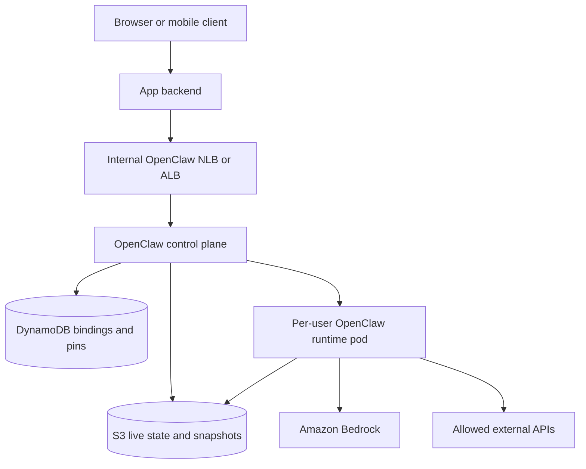

# OpenClaw On AWS Deep Research

Access date for web sources: 2026-05-08.

## Executive Takeaway

OpenClaw is not a normal stateless web app. It is an always-on, stateful Gateway plus an embedded agent runtime, local workspace, skills, sessions, scheduled jobs, provider credentials, and optional tool sandboxes. That one fact determines the AWS design.

For a personal or internal operator setup, run OpenClaw on a single EC2 host with Docker or systemd, persist state on EBS, keep the Gateway private, and access it with Session Manager or a private network path.

For a SaaS product, do not share one OpenClaw Gateway across unrelated users. Use a control plane that creates one runtime boundary per user or workspace. The best AWS-native shape is EKS with a private router/control plane, DynamoDB binding state, S3 runtime state, ECR images, Pod Identity, NetworkPolicy, and optional warm pools. Add Kata Containers only when VM-level tenant isolation is worth the operational tax.

For a pure managed experiment, Amazon Bedrock AgentCore Runtime is worth evaluating, but today it is an adjacent agent hosting platform rather than a documented drop-in host for OpenClaw's Gateway, channel, dashboard, cron, and skill lifecycle.

## OpenClaw Properties That Shape AWS Deployment

OpenClaw's official docs describe a single long-running Gateway process that owns routing, control plane APIs, OpenAI-compatible endpoints, channels, sessions, and the Control UI on the same Gateway port. The default port is `18789`, and the default bind posture is loopback with authentication required.

The agent runtime has a required workspace. OpenClaw expects a workspace directory for tools and context, injects bootstrap files such as `AGENTS.md`, `SOUL.md`, and `TOOLS.md`, and stores session transcripts as JSONL under OpenClaw state. Skills load from the workspace, project agent directories, personal agent directories, managed local skills, bundled skills, and extra configured folders.

That means any AWS deployment has to answer six questions:

1. Where does the always-on Gateway process run?
2. Where do `~/.openclaw`, workspace files, session JSONL, media, cron run logs, and plugin dependency state persist?
3. How does the Gateway authenticate to model providers, especially Bedrock?
4. Who can reach the Gateway port?
5. How are tool execution and sandbox boundaries enforced?
6. How are user or tenant runtimes created, kept warm, suspended, and restored?

## Option Matrix

| Option                              | Best for                                                        | Main AWS services                                                | Persistence                         | Isolation                       | Verdict                                                                    |
| ----------------------------------- | --------------------------------------------------------------- | ---------------------------------------------------------------- | ----------------------------------- | ------------------------------- | -------------------------------------------------------------------------- |
| Local OpenClaw using AWS providers  | Developers who want Bedrock without moving the Gateway          | Bedrock, IAM Identity Center or keys                             | Local disk                          | Local machine                   | Use when the runtime does not need to move to AWS.                         |
| Single EC2 install                  | Personal assistant, homelab replacement, internal operator host | EC2, EBS, IAM role, SSM                                          | EBS                                 | One host, one Gateway           | Best simple AWS path.                                                      |
| EC2 Docker lane                     | Repeatable internal test/staging runtime                        | EC2, EBS, ECR, CodeBuild, Secrets Manager, SSM                   | EBS mounted into container          | One host, one runtime container | Best controlled MVP path.                                                  |
| ECS Fargate service                 | One or a few long-running Gateways with managed container ops   | ECS, Fargate, ECR, EFS or EBS, task role, CloudWatch             | EFS, EBS, or task ephemeral storage | Task boundary                   | Viable for small fleets, less ideal for per-user wake/sleep orchestration. |
| ECS on EC2 or ECS Managed Instances | Container orchestration with more host control                  | ECS, EC2/Managed Instances, EBS/EFS, capacity providers          | EBS/EFS                             | Task plus host                  | Use when Docker/socket/sandbox/host control matters more than Kubernetes.  |
| Simple EKS Deployment               | Internal single Gateway or team runtime                         | EKS, PVC, Secret, ConfigMap, Service                             | PVC, EFS, or EBS                    | Pod boundary                    | Good Kubernetes baseline, not a full multi-tenant design.                  |
| EKS runtime plane with `runc`       | SaaS dedicated runtimes                                         | EKS, ECR, DynamoDB, S3, Redis/ElastiCache, NLB/ALB, Pod Identity | S3 live state plus pod volumes      | Pod/node/NetworkPolicy          | Best production direction for many OpenClaw users.                         |
| EKS runtime plane with Kata         | Higher-assurance tenant isolation                               | EKS, Karpenter, bare metal EC2, Kata, S3, DynamoDB, Redis        | S3 live state                       | VM-level per pod                | Powerful but operationally expensive.                                      |
| AWS App Runner                      | Fastest managed web-container proof of concept                  | App Runner, ECR, IAM, CloudWatch                                 | Mostly externalized state           | Instance boundary               | Only for a very constrained Gateway/API demo.                              |
| Bedrock AgentCore Runtime           | Managed agent hosting experiments                               | Bedrock AgentCore Runtime, IAM, AgentCore Memory/Gateway/Tools   | AgentCore session storage or Memory | Per-session microVM             | Evaluate as an alternative runtime, not as OpenClaw Gateway hosting.       |
| AWS Batch                           | Offline/headless agent jobs                                     | Batch, ECS/EKS/Fargate/EC2, ECR, S3                              | S3/EFS/job artifacts                | Job container                   | Good for batch workflows, not interactive chat.                            |
| Lambda plus EventBridge             | Webhooks, triggers, small tool functions                        | Lambda, EventBridge Scheduler, SQS, Step Functions               | `/tmp`, S3, DynamoDB                | Invocation environment          | Do not host the full Gateway here. Use it around OpenClaw.                 |
| EC2 Mac                             | iMessage/macOS-specific nodes or Apple automation               | EC2 Mac Dedicated Hosts, EBS, SSM/SSH                            | EBS                                 | Dedicated host                  | Niche and expensive, but necessary for real macOS-only surfaces.           |

## Option 0: Keep OpenClaw Local, Use AWS For Models And Services

This is the lowest-risk option when the goal is "use AWS with OpenClaw", not "host OpenClaw on AWS".

Run the Gateway on a developer laptop, workstation, homelab, or existing VPS. Configure OpenClaw's native `amazon-bedrock` provider to use Bedrock through the AWS SDK credential chain. On local machines that usually means `AWS_PROFILE` or AWS SSO. On AWS hosts it means an instance, task, pod, or web-identity role.

Use this path when:

- The assistant is personal.
- Local channels matter, such as desktop automation or local files.
- You mainly want Bedrock models, Bedrock embeddings, or AWS-backed tools.
- You do not need AWS to manage uptime for the Gateway.

Avoid it when:

- The product needs a server-side SLA.
- Multiple users need isolated runtimes.
- Browser or mobile clients need backend-owned access to OpenClaw.

Blog framing: this is the "AWS-powered OpenClaw" option, not the "OpenClaw hosted in AWS" option.

## Option 1: Single EC2 Host, Native Node Or Docker

The simplest true AWS deployment is a single EC2 instance with one Gateway.

The official OpenClaw install path supports Node and Docker. The Docker docs make the containerization tradeoff explicit: Docker is useful when you want an isolated Gateway or want to run OpenClaw on a host without local installs. The Docker setup persists `/home/node/.openclaw` and the workspace by mounting host directories, which maps naturally to an attached EBS volume on EC2.

Recommended AWS shape:

- EC2 instance in a private subnet.
- EBS gp3 volume mounted at `/var/lib/openclaw` or equivalent.
- Instance profile for Bedrock, S3, Secrets Manager, CloudWatch, and SSM as needed.
- No inbound SSH and no public `18789`.
- AWS Systems Manager Session Manager for shell access and port forwarding.
- Gateway token in Secrets Manager or OpenClaw SecretRefs.
- CloudWatch logs from systemd or the Docker runtime.

Use systemd native install when:

- You want the closest match to a personal server install.
- You want fewer container mount and UID issues.
- You do not need container image promotion.

Use Docker when:

- You want immutable runtime images.
- You want to bake plugin dependencies.
- You want easier rollback by image tag.
- You want the Docker sandbox backend available on the same host.

Field note from MorningHQ: a manual EC2 test lane can be made quite repeatable with CodeBuild building the runtime image, ECR storing it, Secrets Manager supplying the runtime env, SSM doing bootstrap/redeploy/port-forwarding, EBS holding state, and a swap file on the persistent volume for small shapes. That pattern is much more reliable than SSHing into a box and running random updates.

Main risk: it is still one host and one runtime. Treat it as personal, staging, internal, or single-tenant.

## Option 2: EC2 Docker, Image-Based Operator Lane

This is a stricter version of Option 1 and probably the best first blog tutorial if the post wants a concrete "build this" guide.

Build and deploy path:

1. Build a runtime image in CodeBuild.
2. Push the image to ECR.
3. Store `OPENCLAW_GATEWAY_TOKEN`, model-provider config, and app callback URLs in Secrets Manager.
4. Bootstrap EC2 through SSM.
5. Run a systemd service that pulls the configured image and starts the OpenClaw container.
6. Persist state, workspace, generated config, plugin runtime deps, and swap on EBS.
7. Verify with `openclaw gateway health` through an SSM port forward.

Why this deserves its own category:

- It preserves the low complexity of EC2.
- It prevents "production by hand-edited server".
- It makes image rollback and state rollback separate operations.
- It matches OpenClaw's stateful runtime model without pretending it is stateless.

This option is not multi-tenant SaaS. It is a clean single-runtime lane.

## Option 3: ECS Fargate Service

ECS Fargate can run a long-lived OpenClaw container without managing EC2 nodes. ECS supports Fargate capacity providers, task IAM roles, Fargate Spot, and services. Fargate Linux tasks get 20 GiB ephemeral storage by default and can configure up to 200 GiB. ECS can also use EFS for shared persistent file storage, and recent ECS support for task-attached EBS gives another block-storage option, with caveats.

Use Fargate when:

- You want managed container service operations.
- The Gateway can keep its state on EFS or another external store.
- You need a small number of stable OpenClaw instances.
- You want task roles for Bedrock/Secrets/S3 without host credentials.

Be careful with:

- Fargate task restarts and placement. OpenClaw state must survive replacement.
- File locking and SQLite-like local state on EFS. Validate with the real state files OpenClaw writes.
- Docker sandboxing. Fargate will not let a task manage sibling Docker containers like a normal host.
- Public exposure. Put the Gateway behind a private ALB/NLB or keep it backend-only.

Possible architectures:

- One ECS service per environment, one shared internal OpenClaw runtime.
- One ECS service per customer, if the customer count is small.
- On-demand standalone ECS tasks for specific background runs.

For serious multi-tenant per-user runtime management, ECS can work but starts to recreate a Kubernetes-style control plane. At that point EKS is usually clearer.

## Option 4: ECS On EC2 Or ECS Managed Instances

ECS on EC2 gives you ECS service orchestration while keeping host-level control. ECS Managed Instances sit between Fargate simplicity and EC2 flexibility. ECS supports capacity providers and lets services move across capacity-provider strategies.

Use this when:

- You want ECS task scheduling but need host-level Docker or storage behavior.
- You need larger disks, custom AMIs, sidecars, privileged operations, or host-level observability.
- Your team does not want Kubernetes yet.

This can support an OpenClaw fleet, but you still need a control plane for user-to-runtime mapping, lifecycle, wake/sleep, state snapshots, and routing. If that fleet grows, EKS becomes a more natural fit because pods, Services, NetworkPolicies, Pod Identity, and controllers model those concerns directly.

## Option 5: Simple EKS Deployment

OpenClaw's official Kubernetes docs provide a minimal starting point: a namespace, a Deployment with one pod, a ClusterIP Service on `18789`, a PVC, a ConfigMap for `openclaw.json` and `AGENTS.md`, and a Secret for tokens and provider keys. The docs explicitly call it a minimal starting point, not production-ready.

Use this when:

- You already have an EKS cluster.
- You want OpenClaw available inside the cluster as an internal service.
- You are running one team Gateway or a test Gateway.
- You want Kubernetes readiness/liveness and PVC behavior without building a custom lifecycle plane.

Production changes needed:

- Replace port-forward access with a private Service, internal ALB/NLB, Tailscale, or a properly authenticated reverse proxy.
- Move secrets to Secrets Manager or External Secrets if that is the platform standard.
- Decide between EBS PVC, EFS, or S3 archive/restore for runtime state.
- Add Pod Identity for Bedrock and AWS API access.
- Add NetworkPolicy.
- Add resource requests, limits, PodDisruptionBudgets, backups, and observability.

This is not a multi-user model by itself. It is one OpenClaw Gateway in Kubernetes.

## Option 6: EKS Multi-Tenant Runtime Plane With `runc`

This is the recommended AWS design for "OpenClaw as a product feature".

Core idea: OpenClaw is single-user by nature, so run many isolated OpenClaw runtime pods and put a control plane in front of them.

AWS sample architecture:

- Router receives traffic and forwards to the active tenant pod.
- Orchestrator creates or wakes tenant pods.
- Redis stores endpoint cache and wake locks.
- DynamoDB stores tenant registry and status.
- S3 stores tenant state and workspace snapshots.
- Karpenter scales nodes.
- EKS Pod Identity scopes AWS credentials to pods.
- NetworkPolicy blocks cross-tenant traffic.
- Warm pool reduces cold-start latency.

MorningHQ's production adaptation keeps the product boundary tighter:

- Browser talks to the app backend.
- FastAPI remains the trusted auth and policy layer.
- FastAPI talks privately to the OpenClaw runtime plane.
- Runtime plane owns wake/sleep/proxy/state.
- Each binding maps to one `(workspace_id, user_id)` runtime boundary.

Suggested AWS architecture:

Runtime contract:

- Stable binding key such as `ws-<workspace_id>-u-<user_id>`.
- Stable private URL such as `/bindings/<binding_key>`.
- Control plane wakes a pod on request.
- Control plane proxies HTTP and WebSocket to the current pod.
- Runtime restores state before startup.
- Sidecar or lifecycle hook syncs state back to S3.
- Pins prevent teardown during onboarding or active sessions.
- Idle reaper deletes pods but preserves logical binding records.

Why `runc` first:

- Lower operational complexity.
- Normal EKS nodes, including managed node groups or Auto Mode, are enough.
- The AWS sample's March 2026 measurements show runc cold start at roughly 2m14s and runc warm start at roughly 54s on the tested Graviton path.
- For many SaaS products, pod isolation plus IAM scoping plus NetworkPolicy plus app-layer policy is the first practical milestone.

What to harden before real customer traffic:

- Binding auth and proxy authorization.
- Per-pod IAM through EKS Pod Identity.
- S3 prefix isolation.
- NetworkPolicy egress and ingress.
- Warm pool sizing.
- Runtime state snapshot and restore tests.
- Exact startup readiness, not just process liveness.
- Control-plane idempotency around wake, suspend, and delete.

## Option 7: EKS Multi-Tenant Runtime Plane With Kata Containers

Kata Containers gives each tenant pod a lightweight VM boundary. The AWS sample uses Kata on bare-metal nodes, Pod Identity ABAC, S3 prefix isolation, NetworkPolicy, and Karpenter.

Use Kata when:

- Tenants are mutually untrusted.
- The agent can execute risky tools.
- Compliance demands stronger isolation than a shared Linux kernel.
- You can tolerate bare-metal node cost and complexity.

Tradeoffs:

- Kata needs hardware virtualization. The AWS sample uses `.metal` nodes for `/dev/kvm`.
- Node provisioning is slower and more complex.
- The sample measured Kata warm start around 43s, but Kata cold start around 5 minutes in the tested path.
- The sample documents operational issues around kata-deploy, containerd restart, Karpenter labels/taints, NetworkPolicy egress, and image architecture.

This is a strong second phase, not necessarily day one.

## Option 8: AWS App Runner

App Runner can turn a container image or source repo into a managed, autoscaled web service. It handles running, scaling, load balancing, and deployment integration.

This is tempting for OpenClaw because it is easy. It is also a poor default for the full Gateway.

Use App Runner only when:

- You want a demo of an OpenClaw-compatible HTTP surface.
- You externalize all durable state.
- You do not need host-level Docker sandboxing.
- You accept App Runner's service model and networking constraints.

Avoid it when:

- You need precise control over local filesystem persistence.
- You need paired channels, local network discovery, or host devices.
- You need per-tenant wake/sleep orchestration.
- You need private backend-to-runtime topologies beyond what App Runner gives cleanly.

Good blog line: App Runner is where you prove the container boots, not where you should start a serious OpenClaw runtime plane.

## Option 9: Amazon Bedrock AgentCore Runtime

AgentCore Runtime is AWS's managed runtime for hosting AI agents and tools. AWS positions it as framework agnostic, model flexible, protocol-aware, and able to run real-time and long-running agent workloads. Sessions run in dedicated microVMs with isolated CPU, memory, and filesystem resources. Sessions can preserve context across invocations and run up to 8 hours per lifecycle. AWS also announced managed session storage in public preview, with up to 1 GB per session and 14 days idle retention.

This is highly relevant to OpenClaw, but it should be framed correctly.

Potential fits:

- Host a custom agent or tool that mirrors part of an OpenClaw workflow.
- Move specific deterministic tools or agent services into managed isolated sessions.
- Compare AgentCore's managed session model against a DIY EKS runtime plane.
- Use AgentCore Gateway/Tools/Memory alongside, or instead of, OpenClaw-managed equivalents for new agent code.

Potential mismatches:

- OpenClaw's Gateway owns channels, Control UI, WebSocket protocol, skills, cron, local workspace behavior, and OpenAI-compatible endpoints.
- AgentCore is not documented as an OpenClaw Gateway hosting target.
- OpenClaw's state and plugin model may exceed AgentCore session-storage constraints for some workflows.
- A SaaS product still needs user/session mapping, entitlement, and product state outside AgentCore. AWS docs explicitly say AgentCore does not enforce session-to-user mappings.

Verdict: include AgentCore as an "AWS-managed agent runtime option to evaluate", not as the default answer to "run OpenClaw in AWS."

## Option 10: AWS Batch For Headless Or Offline OpenClaw Jobs

AWS Batch is for batch computing workloads. It can run container jobs on managed ECS, EKS, EC2, and Fargate capacity, with job queues, dependencies, retries, and resource requirements.

Use Batch when:

- The OpenClaw task is non-interactive.
- You need high-throughput document processing, research runs, or report generation.
- Jobs can read inputs from S3 and write outputs to S3 or a database.
- You want queueing and retries without keeping a Gateway hot.

Do not use Batch for:

- Live chat.
- Channel bridges.
- Control UI.
- Long-lived sessions that users expect to resume immediately.

Batch can be a companion to OpenClaw. It is not the Gateway host.

## Option 11: Lambda, EventBridge Scheduler, And Step Functions Around OpenClaw

AWS Lambda is useful around OpenClaw, not usually under OpenClaw.

Standard Lambda functions time out at 900 seconds. Lambda container images still need to follow Lambda's runtime API, run on a read-only filesystem, use writable `/tmp`, support Linux only, and stay under the uncompressed image-size limit. Lambda `/tmp` can be configured from 512 MB to 10,240 MB.

Good uses:

- Validate and normalize webhooks before forwarding to an OpenClaw runtime plane.
- Run small deterministic tools.
- Sign, mint, or exchange short-lived tokens.
- Trigger wake calls.
- Handle EventBridge Scheduler invocations.
- Fan out to SQS or Step Functions.

Bad uses:

- Hosting the always-on Gateway.
- Storing OpenClaw workspace/session state in `/tmp`.
- Running arbitrary long tool loops.
- Pairing chat channels that expect persistent sockets.

EventBridge Scheduler belongs in this category too. It can invoke AWS APIs on one-time or recurring schedules with retry policies, flexible windows, and DLQs. Use it for platform-level scheduling if you want AWS to wake ECS tasks, Batch jobs, Step Functions, or a backend endpoint. Use OpenClaw cron when the schedule is part of the OpenClaw runtime state and should run as an agent turn.

## Option 12: EC2 Mac For macOS-Only OpenClaw Surfaces

Most OpenClaw-on-AWS options run Linux. That is fine for the Gateway, common chat channels, Bedrock, cron, tools, and web services.

It is not fine for macOS-only surfaces such as iMessage, local desktop automation, or Apple-specific permission models. For those, the cloud option is EC2 Mac.

AWS EC2 Mac instances are Dedicated Hosts with native macOS support. They have a 24-hour minimum allocation period and one Mac instance per Dedicated Host. AWS recommends EBS rather than relying on internal Apple hardware storage.

Use EC2 Mac when:

- You explicitly need macOS.
- You can accept the cost and operational overhead.
- You are building a dedicated Apple-channel node, not a general multi-tenant Linux runtime.

Alternative: keep a real user-owned Mac or Mac mini as a remote node and let the AWS-hosted OpenClaw plane use it for macOS-specific actions.

## Cross-Cutting Design Choices

### Bedrock Integration

OpenClaw has native Bedrock support through the `amazon-bedrock` provider. It uses the AWS SDK default credential chain rather than an API key. On EC2, that means instance roles through IMDS. On ECS, task roles. On EKS, Pod Identity or IRSA. On local machines, AWS env vars, SSO, or shared config.

Required IAM permissions for the native provider include:

- `bedrock:InvokeModel`
- `bedrock:InvokeModelWithResponseStream`
- `bedrock:ListFoundationModels` for discovery
- `bedrock:ListInferenceProfiles` for inference-profile discovery
- `bedrock:ApplyGuardrail` if Bedrock Guardrails are configured

OpenClaw also supports Bedrock embeddings for memory search. That lets an AWS-hosted runtime avoid external embedding API keys.

Bedrock Mantle is a separate OpenAI-compatible provider path backed by Bedrock infrastructure. It is useful when you want an OpenAI-compatible `/v1/chat/completions` model surface through AWS credentials.

### Secrets

There are three workable patterns:

- AWS-native runtime credentials: EC2 instance profiles, ECS task roles, EKS Pod Identity, Lambda roles, or AgentCore roles.
- AWS Secrets Manager injected at deployment/runtime as env vars or mounted secret material.
- OpenClaw SecretRefs using env, file, or exec providers.

Do not put provider custody secrets in the OpenClaw runtime if the app backend should own connected-user authorization. In the MorningHQ design, Nango provider access stays behind FastAPI proxy tools, and the OpenClaw runtime secret does not contain `NANGO_SECRET_KEY`.

### Network Exposure

Default safe posture:

- Keep Gateway on loopback or private network.
- Keep the Gateway token on the backend.
- Browser never talks directly to OpenClaw.
- Use SSM port forwarding for operators.
- Use internal NLB/ALB for backend-to-runtime traffic.
- Use HTTPS, explicit allowed origins, and trusted-proxy mode only when you intentionally expose a Gateway-adjacent surface.

Public Gateway exposure should be rare. If it is required, put it behind TLS, WAF where appropriate, origin restrictions, tight auth, and audited operator scope.

### Persistence

OpenClaw writes state. Design the storage first.

EC2:

- EBS for state/workspace/config/plugin deps.
- EBS snapshots for rollback.
- Optional S3 archive for backups.

ECS Fargate:

- EFS when state must survive service replacement.
- Task-attached EBS can be useful for standalone tasks, but service-managed EBS task volumes are deleted on task termination.
- Fargate ephemeral storage is not durable.

EKS:

- PVC for a simple single Gateway.
- S3 restore/sync for many ephemeral tenant pods.
- EFS CSI for shared file storage, with care around dynamic provisioning and Fargate limitations.

AgentCore:

- Session storage may fit some filesystem state, but current public preview limits and retention must be checked against OpenClaw's real working set before relying on it.

### Scheduling

Scheduling choices depend on ownership:

- OpenClaw cron: when the job is an agent turn owned by the runtime and should use runtime state, delivery, skills, and session context.
- EventBridge Scheduler: when AWS should wake an AWS API target, backend endpoint, Step Function, ECS task, or Batch job.
- ECS scheduled task: when the job is a container run, not an always-on Gateway concern.
- Kubernetes CronJob: when the runtime plane is already Kubernetes-native and the job belongs in-cluster.
- Batch: when queued throughput, retries, and compute environments matter.

### Observability

Minimum proof for any option:

- `GET /healthz` liveness.
- `GET /readyz` readiness where available.
- Authenticated `openclaw gateway health`.
- Model auth status, especially for Bedrock.
- Logs shipped to CloudWatch or an OpenTelemetry collector.
- Runtime state restore and snapshot success metrics.
- NAT, VPC endpoint, and cross-AZ traffic dashboards for EKS/ECS production planes.

OpenClaw supports OpenTelemetry export and Prometheus metrics through diagnostics plugins. Prometheus metrics are served through the authenticated Gateway route, not a public unauthenticated `/metrics` port.

## Recommended Patterns By Scenario

### Personal assistant on AWS

Use EC2 plus EBS plus SSM. Run OpenClaw native or in Docker. Configure Bedrock with an instance role. Keep `18789` private. This is the most honest, shortest path.

### Blog tutorial with useful depth

Build the EC2 Docker operator lane:

- ECR image
- CodeBuild build
- EC2 private host
- EBS state
- Secrets Manager token/provider env
- SSM port forward
- Bedrock instance-role auth
- Gateway health verification

It teaches the right lessons without requiring a full SaaS control plane.

### Small team/internal product

Use ECS Fargate or a simple EKS Deployment. Keep one internal runtime or a tiny number of dedicated runtimes. Persist state deliberately. Keep Gateway access backend-only.

### SaaS multi-tenant product

Use EKS runtime plane with a private control plane:

- One logical binding per user or workspace.
- Runtime pods created on demand.
- DynamoDB for binding state.
- S3 for runtime state.
- Redis/ElastiCache for wake locks and endpoint cache.
- ECR for runtime images.
- Pod Identity for Bedrock/S3.
- Internal ALB/NLB.
- NetworkPolicy.
- Warm pool.

Start with `runc`; graduate to Kata only when the isolation requirement is real.

### High-isolation enterprise runtime

Use EKS plus Kata on bare metal, S3 ABAC, Pod Identity, NetworkPolicy, strong egress controls, and a private backend-owned proxy. Expect more cost, slower cold starts, and more operational work.

### Background research/reporting jobs

Use Batch or ECS scheduled tasks. Treat OpenClaw as a job container or an agent runtime invoked by the job, not as the interactive Gateway.

### Fully managed agent-runtime experiment

Prototype with AgentCore Runtime. Compare:

- Session isolation.
- Storage limits.
- Tool protocol support.
- WebSocket/streaming requirements.
- OpenClaw skill and workspace compatibility.
- Cost and cold-start behavior.

Do not present it as the default OpenClaw hosting answer until the Gateway lifecycle is proven inside AgentCore.

## Blog Angle

Strong thesis:

> Running OpenClaw on AWS is not about finding the cheapest place to put a Node process. It is about deciding how much of a personal, stateful agent runtime you want AWS to own.

Likely title options:

1. `How to Run OpenClaw on AWS Without Turning It Into a Stateless Web App`
2. `OpenClaw on AWS: EC2, ECS, EKS, AgentCore, and the Tradeoffs That Matter`
3. `The Practical AWS Deployment Guide for OpenClaw`

Suggested post structure:

1. `OpenClaw is a stateful Gateway, not a Lambda handler`
2. `The fast path: one EC2 host, private Gateway, Bedrock through IAM`
3. `The controlled path: Docker, ECR, CodeBuild, EBS, and SSM`
4. `The managed-container middle: ECS Fargate and where it breaks down`
5. `The SaaS path: one runtime boundary per user on EKS`
6. `When Kata Containers are worth the pain`
7. `Where AgentCore fits, and where it does not`
8. `Use Lambda, Batch, and EventBridge around OpenClaw, not under it`
9. `A deployment decision table`
10. `FAQ`

FAQ candidates:

- Can OpenClaw run on AWS Lambda?
- Should I use ECS or EKS for OpenClaw?
- How do I use Amazon Bedrock with OpenClaw?
- Can one OpenClaw Gateway serve multiple customers?
- Do I need Kata Containers?
- Should I use Bedrock AgentCore instead of OpenClaw?
- How should I persist OpenClaw state?

## Final Recommendation For The Blog

Write the blog as a decision guide, not a single recipe.

Lead with EC2 because it is the easiest honest deployment. Then explain why the SaaS architecture changes completely: OpenClaw is single-user and stateful, so a productized AWS design needs per-user runtime boundaries and lifecycle orchestration. End with AgentCore as the interesting managed future, not as today's default replacement for OpenClaw's Gateway.

The most useful concrete implementation artifact would be a diagrammed EC2 lane and a diagrammed EKS runtime-plane lane. Those two cover 80 percent of real reader needs:

- "I want my OpenClaw running in AWS this weekend."
- "I want to offer OpenClaw-like dedicated agents to users."
